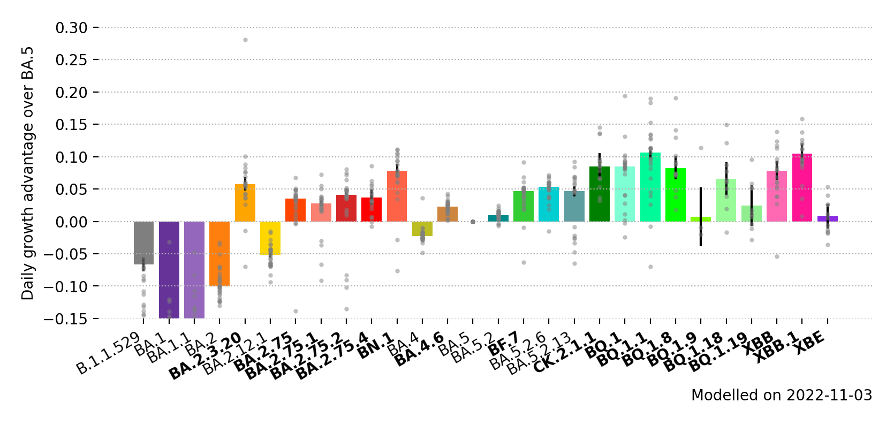
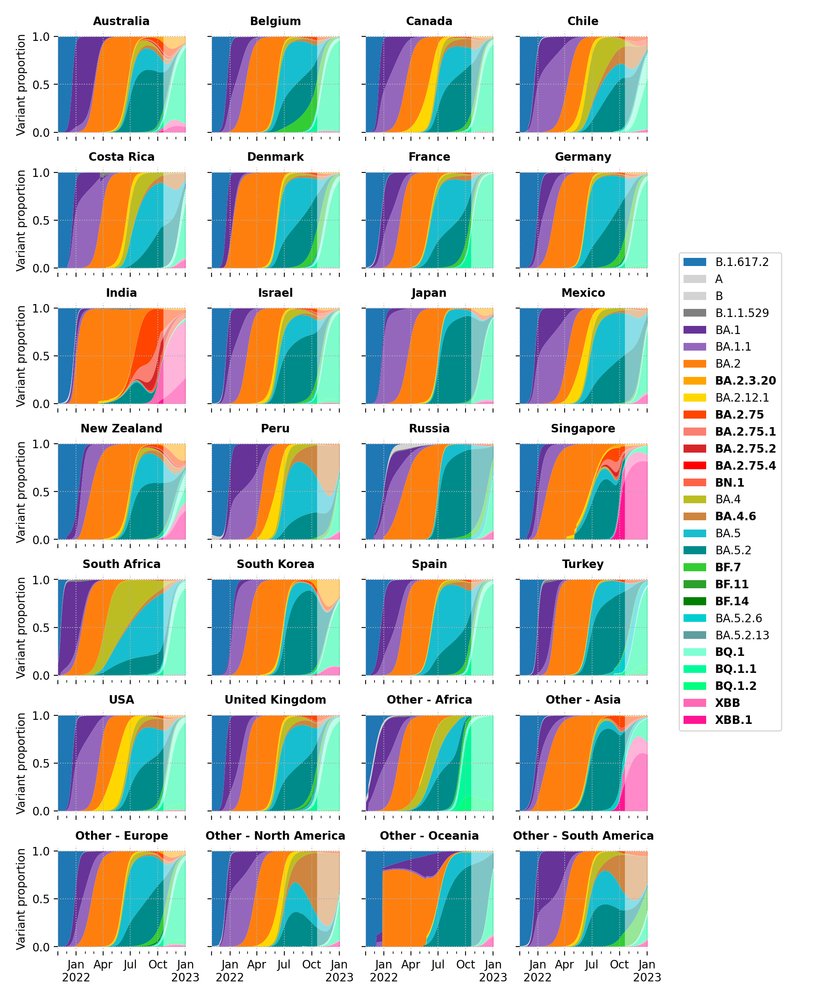

# International SARS-CoV-2 genomic surveillance

This repository uses the `genomicsurveillance` model to estimate daily growth rates of a variety of SARS-CoV-2 lineages in selected countries.

It pulls data from `cov-spectrum.org` on a daily basis.

Latest update: 2022-10-17.

## Growth rates

### In tabular form, per country

<table border="1" class="dataframe">
  <thead>
    <tr style="text-align: right;">
      <th>country</th>
      <th>Australia</th>
      <th>Belgium</th>
      <th>Brazil</th>
      <th>Denmark</th>
      <th>France</th>
      <th>Germany</th>
      <th>India</th>
      <th>Israel</th>
      <th>Japan</th>
      <th>Mexico</th>
      <th>New Zealand</th>
      <th>Singapore</th>
      <th>South Africa</th>
      <th>Spain</th>
      <th>USA</th>
      <th>United Kingdom</th>
    </tr>
  </thead>
  <tbody>
    <tr>
      <th>B.1.1.529</th>
      <td>-10</td>
      <td>-18</td>
      <td>-14</td>
      <td>-15</td>
      <td>-11</td>
      <td>-15</td>
      <td>-2</td>
      <td>-18</td>
      <td>-17</td>
      <td>-18</td>
      <td>-13</td>
      <td>&lt;NA&gt;</td>
      <td>-13</td>
      <td>-14</td>
      <td>-14</td>
      <td>-17</td>
    </tr>
    <tr>
      <th>BA.1</th>
      <td>-19</td>
      <td>-21</td>
      <td>-19</td>
      <td>-22</td>
      <td>-18</td>
      <td>-21</td>
      <td>-14</td>
      <td>-22</td>
      <td>-21</td>
      <td>-19</td>
      <td>-25</td>
      <td>-16</td>
      <td>-16</td>
      <td>-20</td>
      <td>-22</td>
      <td>-22</td>
    </tr>
    <tr>
      <th>BA.1.1</th>
      <td>-17</td>
      <td>-18</td>
      <td>-18</td>
      <td>-16</td>
      <td>-16</td>
      <td>-18</td>
      <td>-12</td>
      <td>-19</td>
      <td>-18</td>
      <td>-17</td>
      <td>-14</td>
      <td>-9</td>
      <td>-14</td>
      <td>-17</td>
      <td>-19</td>
      <td>-19</td>
    </tr>
    <tr>
      <th>BA.2</th>
      <td>-10</td>
      <td>-11</td>
      <td>-11</td>
      <td>-12</td>
      <td>-8</td>
      <td>-12</td>
      <td>-4</td>
      <td>-11</td>
      <td>-10</td>
      <td>-10</td>
      <td>-9</td>
      <td>-4</td>
      <td>-8</td>
      <td>-9</td>
      <td>-11</td>
      <td>-11</td>
    </tr>
    <tr>
      <th>BA.2.3.20</th>
      <td>8</td>
      <td>7</td>
      <td>&lt;NA&gt;</td>
      <td>4</td>
      <td>9</td>
      <td>11</td>
      <td>&lt;NA&gt;</td>
      <td>4</td>
      <td>9</td>
      <td>&lt;NA&gt;</td>
      <td>3</td>
      <td>11</td>
      <td>&lt;NA&gt;</td>
      <td>&lt;NA&gt;</td>
      <td>7</td>
      <td>1</td>
    </tr>
    <tr>
      <th>BA.2.12.1</th>
      <td>-5</td>
      <td>-4</td>
      <td>-7</td>
      <td>-5</td>
      <td>-3</td>
      <td>-5</td>
      <td>-5</td>
      <td>-6</td>
      <td>-7</td>
      <td>-7</td>
      <td>-6</td>
      <td>-2</td>
      <td>-3</td>
      <td>-4</td>
      <td>-7</td>
      <td>-5</td>
    </tr>
    <tr>
      <th>BA.2.75</th>
      <td>3</td>
      <td>5</td>
      <td>&lt;NA&gt;</td>
      <td>4</td>
      <td>5</td>
      <td>4</td>
      <td>4</td>
      <td>4</td>
      <td>3</td>
      <td>6</td>
      <td>3</td>
      <td>6</td>
      <td>-1</td>
      <td>8</td>
      <td>4</td>
      <td>4</td>
    </tr>
    <tr>
      <th>BA.2.75.1</th>
      <td>4</td>
      <td>1</td>
      <td>&lt;NA&gt;</td>
      <td>3</td>
      <td>4</td>
      <td>6</td>
      <td>5</td>
      <td>3</td>
      <td>1</td>
      <td>&lt;NA&gt;</td>
      <td>1</td>
      <td>5</td>
      <td>-3</td>
      <td>4</td>
      <td>3</td>
      <td>3</td>
    </tr>
    <tr>
      <th>BA.2.75.2</th>
      <td>6</td>
      <td>4</td>
      <td>&lt;NA&gt;</td>
      <td>5</td>
      <td>6</td>
      <td>5</td>
      <td>9</td>
      <td>5</td>
      <td>4</td>
      <td>&lt;NA&gt;</td>
      <td>3</td>
      <td>8</td>
      <td>&lt;NA&gt;</td>
      <td>9</td>
      <td>5</td>
      <td>5</td>
    </tr>
    <tr>
      <th>BA.2.75.4</th>
      <td>2</td>
      <td>3</td>
      <td>&lt;NA&gt;</td>
      <td>3</td>
      <td>6</td>
      <td>3</td>
      <td>8</td>
      <td>&lt;NA&gt;</td>
      <td>-1</td>
      <td>&lt;NA&gt;</td>
      <td>&lt;NA&gt;</td>
      <td>7</td>
      <td>&lt;NA&gt;</td>
      <td>&lt;NA&gt;</td>
      <td>3</td>
      <td>3</td>
    </tr>
    <tr>
      <th>BN.1</th>
      <td>8</td>
      <td>8</td>
      <td>&lt;NA&gt;</td>
      <td>4</td>
      <td>10</td>
      <td>7</td>
      <td>12</td>
      <td>7</td>
      <td>9</td>
      <td>&lt;NA&gt;</td>
      <td>2</td>
      <td>11</td>
      <td>&lt;NA&gt;</td>
      <td>&lt;NA&gt;</td>
      <td>7</td>
      <td>7</td>
    </tr>
    <tr>
      <th>BA.4</th>
      <td>-3</td>
      <td>-3</td>
      <td>-1</td>
      <td>-2</td>
      <td>-1</td>
      <td>-2</td>
      <td>-3</td>
      <td>-2</td>
      <td>-4</td>
      <td>-2</td>
      <td>-3</td>
      <td>-2</td>
      <td>-2</td>
      <td>-1</td>
      <td>-2</td>
      <td>-2</td>
    </tr>
    <tr>
      <th>BA.4.6</th>
      <td>2</td>
      <td>4</td>
      <td>3</td>
      <td>2</td>
      <td>4</td>
      <td>3</td>
      <td>4</td>
      <td>3</td>
      <td>2</td>
      <td>3</td>
      <td>2</td>
      <td>2</td>
      <td>0</td>
      <td>4</td>
      <td>2</td>
      <td>2</td>
    </tr>
    <tr>
      <th>BA.5</th>
      <td>0</td>
      <td>0</td>
      <td>0</td>
      <td>0</td>
      <td>0</td>
      <td>0</td>
      <td>0</td>
      <td>0</td>
      <td>0</td>
      <td>0</td>
      <td>0</td>
      <td>0</td>
      <td>0</td>
      <td>0</td>
      <td>0</td>
      <td>0</td>
    </tr>
    <tr>
      <th>BA.5.2</th>
      <td>0</td>
      <td>1</td>
      <td>1</td>
      <td>1</td>
      <td>1</td>
      <td>2</td>
      <td>0</td>
      <td>1</td>
      <td>2</td>
      <td>1</td>
      <td>0</td>
      <td>1</td>
      <td>0</td>
      <td>1</td>
      <td>1</td>
      <td>1</td>
    </tr>
    <tr>
      <th>BF.7</th>
      <td>6</td>
      <td>2</td>
      <td>6</td>
      <td>5</td>
      <td>5</td>
      <td>5</td>
      <td>-1</td>
      <td>5</td>
      <td>5</td>
      <td>5</td>
      <td>4</td>
      <td>9</td>
      <td>-7</td>
      <td>6</td>
      <td>5</td>
      <td>5</td>
    </tr>
    <tr>
      <th>BF.11</th>
      <td>5</td>
      <td>5</td>
      <td>&lt;NA&gt;</td>
      <td>4</td>
      <td>6</td>
      <td>4</td>
      <td>&lt;NA&gt;</td>
      <td>4</td>
      <td>3</td>
      <td>4</td>
      <td>0</td>
      <td>8</td>
      <td>&lt;NA&gt;</td>
      <td>4</td>
      <td>4</td>
      <td>3</td>
    </tr>
    <tr>
      <th>BF.14</th>
      <td>0</td>
      <td>4</td>
      <td>&lt;NA&gt;</td>
      <td>6</td>
      <td>8</td>
      <td>8</td>
      <td>7</td>
      <td>0</td>
      <td>1</td>
      <td>1</td>
      <td>&lt;NA&gt;</td>
      <td>&lt;NA&gt;</td>
      <td>0</td>
      <td>11</td>
      <td>5</td>
      <td>6</td>
    </tr>
    <tr>
      <th>BA.5.2.6</th>
      <td>6</td>
      <td>5</td>
      <td>&lt;NA&gt;</td>
      <td>6</td>
      <td>6</td>
      <td>6</td>
      <td>6</td>
      <td>6</td>
      <td>6</td>
      <td>1</td>
      <td>7</td>
      <td>8</td>
      <td>2</td>
      <td>11</td>
      <td>4</td>
      <td>5</td>
    </tr>
    <tr>
      <th>BA.5.2.13</th>
      <td>6</td>
      <td>&lt;NA&gt;</td>
      <td>&lt;NA&gt;</td>
      <td>5</td>
      <td>8</td>
      <td>3</td>
      <td>&lt;NA&gt;</td>
      <td>&lt;NA&gt;</td>
      <td>&lt;NA&gt;</td>
      <td>&lt;NA&gt;</td>
      <td>&lt;NA&gt;</td>
      <td>&lt;NA&gt;</td>
      <td>&lt;NA&gt;</td>
      <td>4</td>
      <td>5</td>
      <td>5</td>
    </tr>
    <tr>
      <th>CE.1</th>
      <td>&lt;NA&gt;</td>
      <td>-1</td>
      <td>&lt;NA&gt;</td>
      <td>2</td>
      <td>6</td>
      <td>7</td>
      <td>&lt;NA&gt;</td>
      <td>&lt;NA&gt;</td>
      <td>&lt;NA&gt;</td>
      <td>&lt;NA&gt;</td>
      <td>&lt;NA&gt;</td>
      <td>&lt;NA&gt;</td>
      <td>&lt;NA&gt;</td>
      <td>&lt;NA&gt;</td>
      <td>1</td>
      <td>3</td>
    </tr>
    <tr>
      <th>BQ.1</th>
      <td>9</td>
      <td>10</td>
      <td>6</td>
      <td>9</td>
      <td>9</td>
      <td>11</td>
      <td>&lt;NA&gt;</td>
      <td>9</td>
      <td>10</td>
      <td>10</td>
      <td>4</td>
      <td>13</td>
      <td>1</td>
      <td>10</td>
      <td>9</td>
      <td>8</td>
    </tr>
    <tr>
      <th>BQ.1.1</th>
      <td>12</td>
      <td>10</td>
      <td>&lt;NA&gt;</td>
      <td>11</td>
      <td>12</td>
      <td>15</td>
      <td>&lt;NA&gt;</td>
      <td>12</td>
      <td>13</td>
      <td>&lt;NA&gt;</td>
      <td>&lt;NA&gt;</td>
      <td>&lt;NA&gt;</td>
      <td>5</td>
      <td>10</td>
      <td>12</td>
      <td>11</td>
    </tr>
    <tr>
      <th>BQ.1.2</th>
      <td>&lt;NA&gt;</td>
      <td>12</td>
      <td>&lt;NA&gt;</td>
      <td>7</td>
      <td>14</td>
      <td>11</td>
      <td>&lt;NA&gt;</td>
      <td>11</td>
      <td>&lt;NA&gt;</td>
      <td>&lt;NA&gt;</td>
      <td>&lt;NA&gt;</td>
      <td>15</td>
      <td>&lt;NA&gt;</td>
      <td>&lt;NA&gt;</td>
      <td>9</td>
      <td>10</td>
    </tr>
    <tr>
      <th>XBB</th>
      <td>7</td>
      <td>6</td>
      <td>&lt;NA&gt;</td>
      <td>5</td>
      <td>10</td>
      <td>9</td>
      <td>14</td>
      <td>1</td>
      <td>8</td>
      <td>&lt;NA&gt;</td>
      <td>5</td>
      <td>16</td>
      <td>&lt;NA&gt;</td>
      <td>&lt;NA&gt;</td>
      <td>6</td>
      <td>6</td>
    </tr>
    <tr>
      <th>XBB.1</th>
      <td>8</td>
      <td>11</td>
      <td>&lt;NA&gt;</td>
      <td>7</td>
      <td>20</td>
      <td>15</td>
      <td>21</td>
      <td>&lt;NA&gt;</td>
      <td>11</td>
      <td>&lt;NA&gt;</td>
      <td>9</td>
      <td>23</td>
      <td>&lt;NA&gt;</td>
      <td>&lt;NA&gt;</td>
      <td>13</td>
      <td>8</td>
    </tr>
  </tbody>
</table>

Shown is the daily growth advantage over BA.5 in percent.

## Variant share by country

### In tabular form, per country

<table border="1" class="dataframe">
  <thead>
    <tr style="text-align: right;">
      <th>country</th>
      <th>Australia</th>
      <th>Belgium</th>
      <th>Brazil</th>
      <th>Denmark</th>
      <th>France</th>
      <th>Germany</th>
      <th>India</th>
      <th>Israel</th>
      <th>Japan</th>
      <th>Mexico</th>
      <th>New Zealand</th>
      <th>Singapore</th>
      <th>South Africa</th>
      <th>Spain</th>
      <th>USA</th>
      <th>United Kingdom</th>
    </tr>
  </thead>
  <tbody>
    <tr>
      <th>B.1.1.529</th>
      <td>0.0</td>
      <td>0.0</td>
      <td>0.0</td>
      <td>0.0</td>
      <td>0.0</td>
      <td>0.0</td>
      <td>0.0</td>
      <td>0.0</td>
      <td>0.0</td>
      <td>0.0</td>
      <td>0.0</td>
      <td>(0.0)</td>
      <td>0.0</td>
      <td>0.0</td>
      <td>0.0</td>
      <td>0.0</td>
    </tr>
    <tr>
      <th>BA.1</th>
      <td>0.0</td>
      <td>0.0</td>
      <td>0.0</td>
      <td>0.0</td>
      <td>0.0</td>
      <td>0.0</td>
      <td>0.0</td>
      <td>0.0</td>
      <td>0.0</td>
      <td>0.0</td>
      <td>0.0</td>
      <td>0.0</td>
      <td>0.0</td>
      <td>0.0</td>
      <td>0.0</td>
      <td>0.0</td>
    </tr>
    <tr>
      <th>BA.1.1</th>
      <td>0.0</td>
      <td>0.0</td>
      <td>0.0</td>
      <td>0.0</td>
      <td>0.0</td>
      <td>0.0</td>
      <td>0.0</td>
      <td>0.0</td>
      <td>0.0</td>
      <td>0.0</td>
      <td>0.0</td>
      <td>0.0</td>
      <td>0.0</td>
      <td>0.0</td>
      <td>0.0</td>
      <td>0.0</td>
    </tr>
    <tr>
      <th>BA.2</th>
      <td>0.0</td>
      <td>0.0</td>
      <td>0.0</td>
      <td>0.0</td>
      <td>0.0</td>
      <td>0.0</td>
      <td>0.0</td>
      <td>0.0</td>
      <td>0.0</td>
      <td>0.0</td>
      <td>0.0</td>
      <td>0.0</td>
      <td>0.0</td>
      <td>0.0</td>
      <td>0.0</td>
      <td>0.0</td>
    </tr>
    <tr>
      <th>BA.2.3.20</th>
      <td>5.1</td>
      <td>0.5</td>
      <td>(0.0)</td>
      <td>0.7</td>
      <td>0.5</td>
      <td>0.6</td>
      <td>(0.0)</td>
      <td>0.9</td>
      <td>1.9</td>
      <td>(0.0)</td>
      <td>1.3</td>
      <td>2.7</td>
      <td>(0.0)</td>
      <td>(0.0)</td>
      <td>0.7</td>
      <td>0.0</td>
    </tr>
    <tr>
      <th>BA.2.12.1</th>
      <td>0.0</td>
      <td>0.0</td>
      <td>0.0</td>
      <td>0.0</td>
      <td>0.0</td>
      <td>0.0</td>
      <td>0.0</td>
      <td>0.0</td>
      <td>0.0</td>
      <td>0.0</td>
      <td>0.0</td>
      <td>0.0</td>
      <td>0.0</td>
      <td>0.0</td>
      <td>0.0</td>
      <td>0.0</td>
    </tr>
    <tr>
      <th>BA.2.75</th>
      <td>5.0</td>
      <td>1.6</td>
      <td>(0.0)</td>
      <td>0.8</td>
      <td>1.3</td>
      <td>0.7</td>
      <td>12.7</td>
      <td>2.5</td>
      <td>0.6</td>
      <td>1.3</td>
      <td>5.3</td>
      <td>4.5</td>
      <td>0.7</td>
      <td>2.1</td>
      <td>1.6</td>
      <td>1.7</td>
    </tr>
    <tr>
      <th>BA.2.75.1</th>
      <td>3.5</td>
      <td>0.2</td>
      <td>(0.0)</td>
      <td>0.4</td>
      <td>0.2</td>
      <td>0.5</td>
      <td>9.5</td>
      <td>0.8</td>
      <td>0.1</td>
      <td>(0.0)</td>
      <td>0.7</td>
      <td>2.1</td>
      <td>1.2</td>
      <td>0.5</td>
      <td>0.3</td>
      <td>0.4</td>
    </tr>
    <tr>
      <th>BA.2.75.2</th>
      <td>4.8</td>
      <td>0.8</td>
      <td>(0.0)</td>
      <td>0.7</td>
      <td>0.5</td>
      <td>0.5</td>
      <td>20.0</td>
      <td>1.7</td>
      <td>0.4</td>
      <td>(0.0)</td>
      <td>3.0</td>
      <td>2.1</td>
      <td>(0.0)</td>
      <td>0.8</td>
      <td>0.8</td>
      <td>1.2</td>
    </tr>
    <tr>
      <th>BA.2.75.4</th>
      <td>0.5</td>
      <td>0.2</td>
      <td>(0.0)</td>
      <td>0.1</td>
      <td>0.2</td>
      <td>0.6</td>
      <td>1.5</td>
      <td>(0.0)</td>
      <td>0.0</td>
      <td>(0.0)</td>
      <td>(0.0)</td>
      <td>0.1</td>
      <td>(0.0)</td>
      <td>(0.0)</td>
      <td>0.1</td>
      <td>0.1</td>
    </tr>
    <tr>
      <th>BN.1</th>
      <td>3.0</td>
      <td>0.7</td>
      <td>(0.0)</td>
      <td>0.8</td>
      <td>0.4</td>
      <td>0.4</td>
      <td>14.2</td>
      <td>1.6</td>
      <td>0.7</td>
      <td>(0.0)</td>
      <td>0.3</td>
      <td>2.3</td>
      <td>(0.0)</td>
      <td>(0.0)</td>
      <td>0.3</td>
      <td>1.2</td>
    </tr>
    <tr>
      <th>BA.4</th>
      <td>0.6</td>
      <td>0.1</td>
      <td>1.1</td>
      <td>0.2</td>
      <td>0.4</td>
      <td>0.2</td>
      <td>0.0</td>
      <td>0.7</td>
      <td>0.0</td>
      <td>1.2</td>
      <td>0.7</td>
      <td>0.0</td>
      <td>5.3</td>
      <td>0.4</td>
      <td>0.6</td>
      <td>0.5</td>
    </tr>
    <tr>
      <th>BA.4.6</th>
      <td>5.8</td>
      <td>5.0</td>
      <td>7.4</td>
      <td>3.1</td>
      <td>5.8</td>
      <td>2.5</td>
      <td>0.0</td>
      <td>2.5</td>
      <td>0.3</td>
      <td>2.9</td>
      <td>6.3</td>
      <td>0.0</td>
      <td>7.9</td>
      <td>9.6</td>
      <td>12.6</td>
      <td>5.7</td>
    </tr>
    <tr>
      <th>BA.5</th>
      <td>11.7</td>
      <td>13.3</td>
      <td>7.8</td>
      <td>17.0</td>
      <td>13.2</td>
      <td>18.2</td>
      <td>0.0</td>
      <td>10.4</td>
      <td>4.7</td>
      <td>35.3</td>
      <td>21.1</td>
      <td>0.2</td>
      <td>45.8</td>
      <td>23.6</td>
      <td>17.4</td>
      <td>14.0</td>
    </tr>
    <tr>
      <th>BA.5.2</th>
      <td>40.5</td>
      <td>20.9</td>
      <td>31.5</td>
      <td>35.6</td>
      <td>21.9</td>
      <td>36.8</td>
      <td>0.5</td>
      <td>44.5</td>
      <td>82.1</td>
      <td>42.1</td>
      <td>49.6</td>
      <td>2.7</td>
      <td>20.0</td>
      <td>24.6</td>
      <td>39.4</td>
      <td>25.2</td>
    </tr>
    <tr>
      <th>BF.7</th>
      <td>2.6</td>
      <td>25.8</td>
      <td>2.8</td>
      <td>21.4</td>
      <td>12.9</td>
      <td>16.6</td>
      <td>0.0</td>
      <td>7.0</td>
      <td>1.0</td>
      <td>1.3</td>
      <td>1.9</td>
      <td>0.2</td>
      <td>0.1</td>
      <td>16.2</td>
      <td>4.0</td>
      <td>8.8</td>
    </tr>
    <tr>
      <th>BF.11</th>
      <td>1.1</td>
      <td>0.6</td>
      <td>(0.0)</td>
      <td>0.7</td>
      <td>0.9</td>
      <td>0.9</td>
      <td>(0.0)</td>
      <td>0.7</td>
      <td>0.0</td>
      <td>3.8</td>
      <td>0.5</td>
      <td>0.1</td>
      <td>(0.0)</td>
      <td>0.6</td>
      <td>1.0</td>
      <td>4.0</td>
    </tr>
    <tr>
      <th>BF.14</th>
      <td>0.0</td>
      <td>0.6</td>
      <td>(0.0)</td>
      <td>1.1</td>
      <td>0.8</td>
      <td>2.7</td>
      <td>0.0</td>
      <td>0.0</td>
      <td>0.1</td>
      <td>0.4</td>
      <td>(0.0)</td>
      <td>(0.0)</td>
      <td>0.8</td>
      <td>0.8</td>
      <td>0.2</td>
      <td>0.7</td>
    </tr>
    <tr>
      <th>BA.5.2.6</th>
      <td>3.8</td>
      <td>1.5</td>
      <td>(0.0)</td>
      <td>2.3</td>
      <td>2.2</td>
      <td>2.3</td>
      <td>0.2</td>
      <td>3.9</td>
      <td>1.5</td>
      <td>1.0</td>
      <td>3.2</td>
      <td>1.1</td>
      <td>4.7</td>
      <td>7.2</td>
      <td>1.5</td>
      <td>5.0</td>
    </tr>
    <tr>
      <th>BA.5.2.13</th>
      <td>0.4</td>
      <td>(0.0)</td>
      <td>(0.0)</td>
      <td>0.6</td>
      <td>0.3</td>
      <td>0.1</td>
      <td>(0.0)</td>
      <td>(0.0)</td>
      <td>(0.0)</td>
      <td>(0.0)</td>
      <td>(0.0)</td>
      <td>(0.0)</td>
      <td>(0.0)</td>
      <td>0.5</td>
      <td>0.1</td>
      <td>2.8</td>
    </tr>
    <tr>
      <th>CE.1</th>
      <td>(0.0)</td>
      <td>0.0</td>
      <td>(0.0)</td>
      <td>0.0</td>
      <td>0.2</td>
      <td>0.3</td>
      <td>(0.0)</td>
      <td>(0.0)</td>
      <td>(0.0)</td>
      <td>(0.0)</td>
      <td>(0.0)</td>
      <td>(0.0)</td>
      <td>(0.0)</td>
      <td>(0.0)</td>
      <td>0.0</td>
      <td>0.2</td>
    </tr>
    <tr>
      <th>BQ.1</th>
      <td>3.2</td>
      <td>8.2</td>
      <td>49.0</td>
      <td>5.1</td>
      <td>4.8</td>
      <td>4.2</td>
      <td>(0.1)</td>
      <td>4.8</td>
      <td>1.4</td>
      <td>10.1</td>
      <td>2.7</td>
      <td>0.2</td>
      <td>2.2</td>
      <td>8.6</td>
      <td>8.3</td>
      <td>10.9</td>
    </tr>
    <tr>
      <th>BQ.1.1</th>
      <td>5.2</td>
      <td>16.6</td>
      <td>(0.1)</td>
      <td>8.5</td>
      <td>30.6</td>
      <td>7.0</td>
      <td>(0.0)</td>
      <td>12.3</td>
      <td>2.8</td>
      <td>(0.1)</td>
      <td>(0.1)</td>
      <td>(0.0)</td>
      <td>10.9</td>
      <td>3.9</td>
      <td>8.9</td>
      <td>15.2</td>
    </tr>
    <tr>
      <th>BQ.1.2</th>
      <td>(0.0)</td>
      <td>1.2</td>
      <td>(0.0)</td>
      <td>0.2</td>
      <td>1.3</td>
      <td>1.5</td>
      <td>(0.0)</td>
      <td>5.2</td>
      <td>(0.0)</td>
      <td>(0.0)</td>
      <td>(0.0)</td>
      <td>0.4</td>
      <td>(0.0)</td>
      <td>(0.0)</td>
      <td>1.2</td>
      <td>1.8</td>
    </tr>
    <tr>
      <th>XBB</th>
      <td>1.4</td>
      <td>0.2</td>
      <td>(0.0)</td>
      <td>0.1</td>
      <td>0.3</td>
      <td>0.5</td>
      <td>21.7</td>
      <td>0.3</td>
      <td>0.7</td>
      <td>(0.0)</td>
      <td>1.2</td>
      <td>1.8</td>
      <td>(0.0)</td>
      <td>(0.0)</td>
      <td>0.2</td>
      <td>0.2</td>
    </tr>
    <tr>
      <th>XBB.1</th>
      <td>1.8</td>
      <td>2.0</td>
      <td>(0.2)</td>
      <td>0.4</td>
      <td>1.1</td>
      <td>2.7</td>
      <td>19.6</td>
      <td>(0.3)</td>
      <td>1.6</td>
      <td>(0.3)</td>
      <td>2.0</td>
      <td>79.4</td>
      <td>(0.3)</td>
      <td>(0.3)</td>
      <td>0.8</td>
      <td>0.3</td>
    </tr>
  </tbody>
</table>

Shown is the estimated variant proportion on 2022-10-17 in percent. 

Values in parentheses mean that the variant has not been detected in the specific country and are imputed instead.
