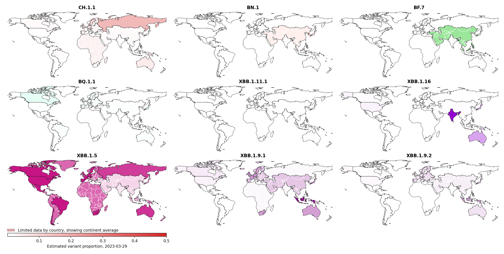

# International SARS-CoV-2 genomic surveillance

This repository uses the [genomicsurveillance](https://github.com/gerstung-lab/genomicsurveillance) model to estimate daily growth rates of a variety of SARS-CoV-2 lineages in selected countries. It fits a logistic linear model to daily lineage counts using a Dirichlet-Multinomial model. The growth rates are modelled in a hierarchical Bayesian fashion using stochastic variational inference. 

The model is described in detail in our publication [Genomic reconstruction of the SARS-CoV-2 epidemic in England](https://www.nature.com/articles/s41586-021-04069-y).

The current code pulls aggregated data from [cov-spectrum.org](cov-spectrum.org); the underlying data is proved by GISAID. Case data is from [Our World in Data](https://ourworldindata.org/explorers/coronavirus-data-explorer).

Latest update: 2023-03-24, based on 9161381 genomic sequences.

## Growth rates

Each dot represents a country (MAP estimate). Bars denote the shared mean, errorbars are the 90% posterior interval.

### In tabular form, per country

Other countries are grouped into geographic regions.

<small><table border="1" class="dataframe">
  <thead>
    <tr style="text-align: right;">
      <th></th>
      <th>Australia</th>
      <th>Austria</th>
      <th>Brazil</th>
      <th>Canada</th>
      <th>Chile</th>
      <th>Denmark</th>
      <th>France</th>
      <th>Germany</th>
      <th>India</th>
      <th>Indonesia</th>
      <th>Israel</th>
      <th>Japan</th>
      <th>Mexico</th>
      <th>Other - Africa</th>
      <th>Other - Asia</th>
      <th>Other - Europe</th>
      <th>Other - North America</th>
      <th>Other - Oceania</th>
      <th>Other - South America</th>
      <th>Russia</th>
      <th>Singapore</th>
      <th>South Africa</th>
      <th>South Korea</th>
      <th>Spain</th>
      <th>Sweden</th>
      <th>Turkey</th>
      <th>USA</th>
      <th>United Kingdom</th>
    </tr>
  </thead>
  <tbody>
    <tr>
      <th>B.1.1.529</th>
      <td>-7±1</td>
      <td>-5±1</td>
      <td>-6±1</td>
      <td>-5±1</td>
      <td>-4±1</td>
      <td>-5±1</td>
      <td>-7±1</td>
      <td>-5±1</td>
      <td>-4±1</td>
      <td>-10±11</td>
      <td>-5±1</td>
      <td>-5±1</td>
      <td>-4±1</td>
      <td>-6±1</td>
      <td>-5±1</td>
      <td>-10±1</td>
      <td>-12±1</td>
      <td>-9±1</td>
      <td>-7±1</td>
      <td>-8±1</td>
      <td>-5±1</td>
      <td>-9±1</td>
      <td>-28±8</td>
      <td>-4±1</td>
      <td>-5±1</td>
      <td>-10±1</td>
      <td>-5±1</td>
      <td>-7±1</td>
    </tr>
    <tr>
      <th>BA.1</th>
      <td>-16±0</td>
      <td>-14±0</td>
      <td>-14±0</td>
      <td>-18±0</td>
      <td>-18±0</td>
      <td>-18±0</td>
      <td>-17±0</td>
      <td>-17±0</td>
      <td>-13±0</td>
      <td>-13±0</td>
      <td>-18±0</td>
      <td>-18±0</td>
      <td>-14±0</td>
      <td>-14±0</td>
      <td>-13±0</td>
      <td>-16±0</td>
      <td>-16±0</td>
      <td>-21±0</td>
      <td>-14±0</td>
      <td>-15±0</td>
      <td>-17±0</td>
      <td>-16±0</td>
      <td>-19±0</td>
      <td>-17±0</td>
      <td>-17±0</td>
      <td>-16±0</td>
      <td>-16±0</td>
      <td>-17±0</td>
    </tr>
    <tr>
      <th>BA.1.1</th>
      <td>-14±0</td>
      <td>-11±0</td>
      <td>-12±0</td>
      <td>-15±0</td>
      <td>-16±0</td>
      <td>-13±0</td>
      <td>-15±0</td>
      <td>-15±0</td>
      <td>-11±0</td>
      <td>-14±0</td>
      <td>-15±0</td>
      <td>-15±0</td>
      <td>-12±0</td>
      <td>-13±0</td>
      <td>-10±0</td>
      <td>-13±0</td>
      <td>-15±0</td>
      <td>-14±0</td>
      <td>-13±0</td>
      <td>-13±0</td>
      <td>-9±0</td>
      <td>-14±0</td>
      <td>-16±0</td>
      <td>-14±0</td>
      <td>-14±0</td>
      <td>-12±0</td>
      <td>-14±0</td>
      <td>-14±0</td>
    </tr>
    <tr>
      <th>BA.2</th>
      <td>-8±0</td>
      <td>-7±0</td>
      <td>-8±0</td>
      <td>-10±0</td>
      <td>-10±0</td>
      <td>-9±0</td>
      <td>-8±0</td>
      <td>-8±0</td>
      <td>-4±0</td>
      <td>-6±0</td>
      <td>-8±0</td>
      <td>-8±0</td>
      <td>-7±0</td>
      <td>-6±0</td>
      <td>-5±0</td>
      <td>-8±0</td>
      <td>-9±0</td>
      <td>-9±0</td>
      <td>-7±0</td>
      <td>-9±0</td>
      <td>-4±0</td>
      <td>-9±0</td>
      <td>-9±0</td>
      <td>-7±0</td>
      <td>-9±0</td>
      <td>-6±0</td>
      <td>-8±0</td>
      <td>-8±0</td>
    </tr>
    <tr>
      <th>BA.2.3.20</th>
      <td>3±0</td>
      <td>1±0</td>
      <td>-4±3</td>
      <td>4±0</td>
      <td>3±1</td>
      <td>3±0</td>
      <td>5±0</td>
      <td>4±0</td>
      <td>9±1</td>
      <td>2±1</td>
      <td>3±0</td>
      <td>2±0</td>
      <td>5±1</td>
      <td>2±1</td>
      <td>2±0</td>
      <td>4±0</td>
      <td>2±1</td>
      <td>3±0</td>
      <td>-3±2</td>
      <td>1±1</td>
      <td>4±0</td>
      <td>-2±2</td>
      <td>3±0</td>
      <td>5±1</td>
      <td>3±0</td>
      <td>3±2</td>
      <td>4±0</td>
      <td>4±0</td>
    </tr>
    <tr>
      <th>BA.2.12.1</th>
      <td>-4±0</td>
      <td>-4±0</td>
      <td>-6±0</td>
      <td>-6±0</td>
      <td>-7±0</td>
      <td>-4±0</td>
      <td>-3±0</td>
      <td>-3±0</td>
      <td>-5±0</td>
      <td>-4±0</td>
      <td>-5±0</td>
      <td>-5±0</td>
      <td>-5±0</td>
      <td>-4±0</td>
      <td>-3±0</td>
      <td>-3±0</td>
      <td>-6±0</td>
      <td>-7±0</td>
      <td>-5±0</td>
      <td>-6±0</td>
      <td>-3±0</td>
      <td>-2±1</td>
      <td>-5±0</td>
      <td>-3±0</td>
      <td>-5±0</td>
      <td>-3±0</td>
      <td>-5±0</td>
      <td>-3±0</td>
    </tr>
    <tr>
      <th>BA.2.75</th>
      <td>4±0</td>
      <td>2±0</td>
      <td>1±0</td>
      <td>2±0</td>
      <td>4±0</td>
      <td>3±0</td>
      <td>4±0</td>
      <td>3±0</td>
      <td>4±0</td>
      <td>3±0</td>
      <td>3±0</td>
      <td>2±0</td>
      <td>3±0</td>
      <td>4±0</td>
      <td>1±0</td>
      <td>3±0</td>
      <td>2±0</td>
      <td>4±0</td>
      <td>4±0</td>
      <td>1±0</td>
      <td>2±0</td>
      <td>0±1</td>
      <td>3±0</td>
      <td>4±0</td>
      <td>3±0</td>
      <td>3±0</td>
      <td>3±0</td>
      <td>3±0</td>
    </tr>
    <tr>
      <th>CH.1.1</th>
      <td>7±0</td>
      <td>7±0</td>
      <td>9±1</td>
      <td>9±0</td>
      <td>9±1</td>
      <td>9±0</td>
      <td>10±0</td>
      <td>9±0</td>
      <td>11±0</td>
      <td>9±0</td>
      <td>9±0</td>
      <td>4±0</td>
      <td>7±1</td>
      <td>11±0</td>
      <td>3±0</td>
      <td>9±0</td>
      <td>11±1</td>
      <td>7±0</td>
      <td>8±0</td>
      <td>11±1</td>
      <td>7±0</td>
      <td>7±1</td>
      <td>6±0</td>
      <td>11±0</td>
      <td>9±0</td>
      <td>10±1</td>
      <td>8±0</td>
      <td>9±0</td>
    </tr>
    <tr>
      <th>BN.1</th>
      <td>5±0</td>
      <td>4±0</td>
      <td>3±0</td>
      <td>5±0</td>
      <td>4±0</td>
      <td>6±0</td>
      <td>7±0</td>
      <td>6±0</td>
      <td>9±0</td>
      <td>6±0</td>
      <td>5±0</td>
      <td>4±0</td>
      <td>3±0</td>
      <td>5±0</td>
      <td>3±0</td>
      <td>6±0</td>
      <td>4±1</td>
      <td>5±0</td>
      <td>7±0</td>
      <td>5±0</td>
      <td>5±0</td>
      <td>2±1</td>
      <td>6±0</td>
      <td>6±0</td>
      <td>6±0</td>
      <td>6±0</td>
      <td>5±0</td>
      <td>5±0</td>
    </tr>
    <tr>
      <th>BA.4</th>
      <td>-2±0</td>
      <td>-2±0</td>
      <td>-3±0</td>
      <td>-2±0</td>
      <td>-2±0</td>
      <td>-2±0</td>
      <td>-1±0</td>
      <td>-2±0</td>
      <td>-3±0</td>
      <td>-3±0</td>
      <td>-2±0</td>
      <td>-3±0</td>
      <td>-2±0</td>
      <td>-2±0</td>
      <td>-2±0</td>
      <td>-1±0</td>
      <td>-2±0</td>
      <td>-3±0</td>
      <td>-2±0</td>
      <td>-4±0</td>
      <td>-2±0</td>
      <td>-2±0</td>
      <td>-3±0</td>
      <td>-1±0</td>
      <td>-2±0</td>
      <td>-2±0</td>
      <td>-2±0</td>
      <td>-2±0</td>
    </tr>
    <tr>
      <th>BA.4.6</th>
      <td>1±0</td>
      <td>0±0</td>
      <td>0±0</td>
      <td>1±0</td>
      <td>2±0</td>
      <td>1±0</td>
      <td>2±0</td>
      <td>2±0</td>
      <td>3±1</td>
      <td>1±0</td>
      <td>2±0</td>
      <td>1±0</td>
      <td>1±0</td>
      <td>2±0</td>
      <td>1±0</td>
      <td>2±0</td>
      <td>0±0</td>
      <td>1±0</td>
      <td>1±0</td>
      <td>-1±1</td>
      <td>1±1</td>
      <td>0±0</td>
      <td>0±0</td>
      <td>2±0</td>
      <td>1±0</td>
      <td>2±1</td>
      <td>1±0</td>
      <td>1±0</td>
    </tr>
    <tr>
      <th>BA.5</th>
      <td>0±0</td>
      <td>0±0</td>
      <td>0±0</td>
      <td>0±0</td>
      <td>0±0</td>
      <td>0±0</td>
      <td>0±0</td>
      <td>0±0</td>
      <td>0±0</td>
      <td>0±0</td>
      <td>0±0</td>
      <td>0±0</td>
      <td>0±0</td>
      <td>0±0</td>
      <td>0±0</td>
      <td>0±0</td>
      <td>0±0</td>
      <td>0±0</td>
      <td>0±0</td>
      <td>0±0</td>
      <td>0±0</td>
      <td>0±0</td>
      <td>0±0</td>
      <td>0±0</td>
      <td>0±0</td>
      <td>0±0</td>
      <td>0±0</td>
      <td>0±0</td>
    </tr>
    <tr>
      <th>BA.5.2</th>
      <td>0±0</td>
      <td>0±0</td>
      <td>-1±0</td>
      <td>1±0</td>
      <td>1±0</td>
      <td>1±0</td>
      <td>1±0</td>
      <td>1±0</td>
      <td>0±0</td>
      <td>0±0</td>
      <td>1±0</td>
      <td>1±0</td>
      <td>1±0</td>
      <td>0±0</td>
      <td>1±0</td>
      <td>1±0</td>
      <td>1±0</td>
      <td>1±0</td>
      <td>0±0</td>
      <td>0±0</td>
      <td>1±0</td>
      <td>-1±0</td>
      <td>1±0</td>
      <td>1±0</td>
      <td>1±0</td>
      <td>1±0</td>
      <td>1±0</td>
      <td>1±0</td>
    </tr>
    <tr>
      <th>BA.5.2.1</th>
      <td>0±0</td>
      <td>0±0</td>
      <td>-2±0</td>
      <td>0±0</td>
      <td>1±0</td>
      <td>0±0</td>
      <td>1±0</td>
      <td>1±0</td>
      <td>0±0</td>
      <td>0±0</td>
      <td>0±0</td>
      <td>1±0</td>
      <td>0±0</td>
      <td>-1±0</td>
      <td>0±0</td>
      <td>1±0</td>
      <td>0±0</td>
      <td>0±0</td>
      <td>0±0</td>
      <td>-1±0</td>
      <td>0±0</td>
      <td>-2±0</td>
      <td>1±0</td>
      <td>1±0</td>
      <td>0±0</td>
      <td>0±0</td>
      <td>0±0</td>
      <td>0±0</td>
    </tr>
    <tr>
      <th>BF.7</th>
      <td>3±0</td>
      <td>2±0</td>
      <td>0±0</td>
      <td>3±0</td>
      <td>2±0</td>
      <td>2±0</td>
      <td>4±0</td>
      <td>3±0</td>
      <td>9±1</td>
      <td>4±1</td>
      <td>3±0</td>
      <td>4±0</td>
      <td>2±0</td>
      <td>1±0</td>
      <td>4±0</td>
      <td>3±0</td>
      <td>3±0</td>
      <td>3±0</td>
      <td>2±0</td>
      <td>1±0</td>
      <td>5±0</td>
      <td>1±0</td>
      <td>4±0</td>
      <td>3±0</td>
      <td>3±0</td>
      <td>2±0</td>
      <td>3±0</td>
      <td>3±0</td>
    </tr>
    <tr>
      <th>BA.5.2.6</th>
      <td>3±0</td>
      <td>2±0</td>
      <td>-2±1</td>
      <td>3±0</td>
      <td>2±1</td>
      <td>3±0</td>
      <td>4±0</td>
      <td>4±0</td>
      <td>5±1</td>
      <td>3±0</td>
      <td>4±0</td>
      <td>3±0</td>
      <td>1±1</td>
      <td>2±0</td>
      <td>1±0</td>
      <td>3±0</td>
      <td>1±1</td>
      <td>3±0</td>
      <td>-1±1</td>
      <td>2±0</td>
      <td>2±0</td>
      <td>0±0</td>
      <td>3±0</td>
      <td>3±0</td>
      <td>3±0</td>
      <td>3±0</td>
      <td>3±0</td>
      <td>3±0</td>
    </tr>
    <tr>
      <th>BA.5.2.13</th>
      <td>2±0</td>
      <td>2±0</td>
      <td>&lt;NA&gt;</td>
      <td>3±0</td>
      <td>-17±7</td>
      <td>2±0</td>
      <td>3±0</td>
      <td>4±0</td>
      <td>&lt;NA&gt;</td>
      <td>1±1</td>
      <td>3±1</td>
      <td>-14±10</td>
      <td>0±2</td>
      <td>-4±4</td>
      <td>2±0</td>
      <td>3±0</td>
      <td>0±1</td>
      <td>-7±3</td>
      <td>-20±6</td>
      <td>-1±2</td>
      <td>2±1</td>
      <td>-12±5</td>
      <td>-1±1</td>
      <td>3±1</td>
      <td>3±0</td>
      <td>0±2</td>
      <td>3±0</td>
      <td>3±0</td>
    </tr>
    <tr>
      <th>CK.2.1.1</th>
      <td>3±1</td>
      <td>2±0</td>
      <td>-4±2</td>
      <td>5±0</td>
      <td>5±2</td>
      <td>3±0</td>
      <td>6±0</td>
      <td>3±0</td>
      <td>&lt;NA&gt;</td>
      <td>&lt;NA&gt;</td>
      <td>5±0</td>
      <td>2±1</td>
      <td>2±1</td>
      <td>&lt;NA&gt;</td>
      <td>-8±3</td>
      <td>4±0</td>
      <td>&lt;NA&gt;</td>
      <td>-1±1</td>
      <td>3±2</td>
      <td>-7±5</td>
      <td>0±2</td>
      <td>-18±7</td>
      <td>-1±1</td>
      <td>4±0</td>
      <td>3±1</td>
      <td>0±5</td>
      <td>4±0</td>
      <td>5±0</td>
    </tr>
    <tr>
      <th>BQ.1</th>
      <td>4±0</td>
      <td>4±0</td>
      <td>4±0</td>
      <td>5±0</td>
      <td>5±0</td>
      <td>5±0</td>
      <td>6±0</td>
      <td>5±0</td>
      <td>10±0</td>
      <td>5±0</td>
      <td>5±0</td>
      <td>4±0</td>
      <td>4±0</td>
      <td>4±0</td>
      <td>2±0</td>
      <td>5±0</td>
      <td>5±0</td>
      <td>5±0</td>
      <td>6±0</td>
      <td>6±0</td>
      <td>4±0</td>
      <td>2±0</td>
      <td>5±0</td>
      <td>6±0</td>
      <td>5±0</td>
      <td>5±0</td>
      <td>5±0</td>
      <td>5±0</td>
    </tr>
    <tr>
      <th>BQ.1.1</th>
      <td>5±0</td>
      <td>5±0</td>
      <td>4±0</td>
      <td>6±0</td>
      <td>7±0</td>
      <td>5±0</td>
      <td>6±0</td>
      <td>6±0</td>
      <td>12±0</td>
      <td>7±0</td>
      <td>6±0</td>
      <td>4±0</td>
      <td>5±0</td>
      <td>4±0</td>
      <td>2±0</td>
      <td>6±0</td>
      <td>6±0</td>
      <td>5±0</td>
      <td>6±0</td>
      <td>4±1</td>
      <td>5±0</td>
      <td>4±0</td>
      <td>4±0</td>
      <td>7±0</td>
      <td>6±0</td>
      <td>6±0</td>
      <td>6±0</td>
      <td>6±0</td>
    </tr>
    <tr>
      <th>BQ.1.1.20</th>
      <td>-14±8</td>
      <td>6±1</td>
      <td>&lt;NA&gt;</td>
      <td>-4±5</td>
      <td>&lt;NA&gt;</td>
      <td>6±0</td>
      <td>7±1</td>
      <td>7±0</td>
      <td>&lt;NA&gt;</td>
      <td>&lt;NA&gt;</td>
      <td>-14±7</td>
      <td>&lt;NA&gt;</td>
      <td>&lt;NA&gt;</td>
      <td>&lt;NA&gt;</td>
      <td>&lt;NA&gt;</td>
      <td>8±1</td>
      <td>&lt;NA&gt;</td>
      <td>&lt;NA&gt;</td>
      <td>&lt;NA&gt;</td>
      <td>&lt;NA&gt;</td>
      <td>&lt;NA&gt;</td>
      <td>&lt;NA&gt;</td>
      <td>-15±7</td>
      <td>&lt;NA&gt;</td>
      <td>7±1</td>
      <td>&lt;NA&gt;</td>
      <td>8±1</td>
      <td>6±1</td>
    </tr>
    <tr>
      <th>BQ.1.9</th>
      <td>&lt;NA&gt;</td>
      <td>4±0</td>
      <td>&lt;NA&gt;</td>
      <td>6±1</td>
      <td>&lt;NA&gt;</td>
      <td>&lt;NA&gt;</td>
      <td>-15±8</td>
      <td>&lt;NA&gt;</td>
      <td>8±2</td>
      <td>-15±8</td>
      <td>-4±3</td>
      <td>-17±7</td>
      <td>&lt;NA&gt;</td>
      <td>-10±5</td>
      <td>&lt;NA&gt;</td>
      <td>5±0</td>
      <td>&lt;NA&gt;</td>
      <td>&lt;NA&gt;</td>
      <td>-6±4</td>
      <td>&lt;NA&gt;</td>
      <td>&lt;NA&gt;</td>
      <td>&lt;NA&gt;</td>
      <td>3±0</td>
      <td>&lt;NA&gt;</td>
      <td>&lt;NA&gt;</td>
      <td>&lt;NA&gt;</td>
      <td>5±0</td>
      <td>&lt;NA&gt;</td>
    </tr>
    <tr>
      <th>XBB</th>
      <td>4±0</td>
      <td>3±0</td>
      <td>6±1</td>
      <td>4±0</td>
      <td>7±0</td>
      <td>5±0</td>
      <td>7±0</td>
      <td>5±0</td>
      <td>10±0</td>
      <td>6±0</td>
      <td>6±0</td>
      <td>1±0</td>
      <td>7±1</td>
      <td>7±0</td>
      <td>1±0</td>
      <td>6±0</td>
      <td>7±1</td>
      <td>6±0</td>
      <td>7±0</td>
      <td>7±0</td>
      <td>4±0</td>
      <td>5±1</td>
      <td>2±0</td>
      <td>7±0</td>
      <td>5±0</td>
      <td>6±1</td>
      <td>5±0</td>
      <td>5±0</td>
    </tr>
    <tr>
      <th>XBB.1</th>
      <td>4±0</td>
      <td>4±0</td>
      <td>7±0</td>
      <td>6±0</td>
      <td>7±0</td>
      <td>5±0</td>
      <td>7±0</td>
      <td>7±0</td>
      <td>10±0</td>
      <td>7±0</td>
      <td>7±0</td>
      <td>1±0</td>
      <td>7±0</td>
      <td>7±0</td>
      <td>2±0</td>
      <td>6±0</td>
      <td>6±0</td>
      <td>4±0</td>
      <td>8±0</td>
      <td>8±0</td>
      <td>3±0</td>
      <td>7±1</td>
      <td>3±0</td>
      <td>8±0</td>
      <td>6±0</td>
      <td>7±1</td>
      <td>6±0</td>
      <td>6±0</td>
    </tr>
    <tr>
      <th>XBB.1.5</th>
      <td>12±0</td>
      <td>11±0</td>
      <td>13±0</td>
      <td>12±0</td>
      <td>14±0</td>
      <td>13±0</td>
      <td>14±0</td>
      <td>12±0</td>
      <td>14±0</td>
      <td>14±1</td>
      <td>12±0</td>
      <td>9±0</td>
      <td>15±0</td>
      <td>16±0</td>
      <td>6±0</td>
      <td>12±0</td>
      <td>15±0</td>
      <td>13±0</td>
      <td>15±0</td>
      <td>11±1</td>
      <td>11±1</td>
      <td>16±0</td>
      <td>10±0</td>
      <td>15±0</td>
      <td>13±0</td>
      <td>&lt;NA&gt;</td>
      <td>12±0</td>
      <td>13±0</td>
    </tr>
    <tr>
      <th>XBB.1.9.1</th>
      <td>14±1</td>
      <td>13±1</td>
      <td>&lt;NA&gt;</td>
      <td>14±1</td>
      <td>10±7</td>
      <td>16±1</td>
      <td>17±1</td>
      <td>15±0</td>
      <td>15±1</td>
      <td>15±1</td>
      <td>16±1</td>
      <td>12±1</td>
      <td>&lt;NA&gt;</td>
      <td>7±4</td>
      <td>7±0</td>
      <td>15±0</td>
      <td>&lt;NA&gt;</td>
      <td>15±1</td>
      <td>-4±8</td>
      <td>3±6</td>
      <td>12±1</td>
      <td>18±2</td>
      <td>14±1</td>
      <td>18±1</td>
      <td>16±1</td>
      <td>-8±8</td>
      <td>16±1</td>
      <td>15±0</td>
    </tr>
    <tr>
      <th>XBB.1.9.2</th>
      <td>11±1</td>
      <td>13±0</td>
      <td>-7±9</td>
      <td>15±2</td>
      <td>2±7</td>
      <td>14±1</td>
      <td>15±1</td>
      <td>14±1</td>
      <td>10±1</td>
      <td>14±1</td>
      <td>17±1</td>
      <td>14±4</td>
      <td>&lt;NA&gt;</td>
      <td>-7±8</td>
      <td>8±1</td>
      <td>16±1</td>
      <td>&lt;NA&gt;</td>
      <td>12±1</td>
      <td>&lt;NA&gt;</td>
      <td>&lt;NA&gt;</td>
      <td>13±1</td>
      <td>6±5</td>
      <td>11±2</td>
      <td>16±1</td>
      <td>16±1</td>
      <td>&lt;NA&gt;</td>
      <td>16±1</td>
      <td>16±1</td>
    </tr>
    <tr>
      <th>XBB.1.11.1</th>
      <td>-5±8</td>
      <td>12±0</td>
      <td>&lt;NA&gt;</td>
      <td>&lt;NA&gt;</td>
      <td>&lt;NA&gt;</td>
      <td>-13±8</td>
      <td>-8±8</td>
      <td>-11±7</td>
      <td>11±2</td>
      <td>12±1</td>
      <td>6±5</td>
      <td>-1±4</td>
      <td>&lt;NA&gt;</td>
      <td>&lt;NA&gt;</td>
      <td>7±1</td>
      <td>4±3</td>
      <td>&lt;NA&gt;</td>
      <td>&lt;NA&gt;</td>
      <td>&lt;NA&gt;</td>
      <td>&lt;NA&gt;</td>
      <td>12±1</td>
      <td>&lt;NA&gt;</td>
      <td>4±4</td>
      <td>-9±7</td>
      <td>&lt;NA&gt;</td>
      <td>&lt;NA&gt;</td>
      <td>-7±8</td>
      <td>11±6</td>
    </tr>
    <tr>
      <th>XBB.1.16</th>
      <td>18±4</td>
      <td>11±3</td>
      <td>&lt;NA&gt;</td>
      <td>-2±9</td>
      <td>&lt;NA&gt;</td>
      <td>9±5</td>
      <td>&lt;NA&gt;</td>
      <td>12±3</td>
      <td>21±1</td>
      <td>&lt;NA&gt;</td>
      <td>&lt;NA&gt;</td>
      <td>21±4</td>
      <td>&lt;NA&gt;</td>
      <td>&lt;NA&gt;</td>
      <td>13±1</td>
      <td>4±4</td>
      <td>&lt;NA&gt;</td>
      <td>22±6</td>
      <td>&lt;NA&gt;</td>
      <td>&lt;NA&gt;</td>
      <td>12±3</td>
      <td>&lt;NA&gt;</td>
      <td>5±6</td>
      <td>&lt;NA&gt;</td>
      <td>-2±8</td>
      <td>&lt;NA&gt;</td>
      <td>21±1</td>
      <td>16±2</td>
    </tr>
    <tr>
      <th>XBF</th>
      <td>6±0</td>
      <td>7±0</td>
      <td>-8±7</td>
      <td>9±0</td>
      <td>3±5</td>
      <td>9±0</td>
      <td>10±0</td>
      <td>9±0</td>
      <td>11±1</td>
      <td>7±1</td>
      <td>8±0</td>
      <td>4±0</td>
      <td>0±4</td>
      <td>6±2</td>
      <td>4±1</td>
      <td>9±0</td>
      <td>-15±8</td>
      <td>7±0</td>
      <td>&lt;NA&gt;</td>
      <td>&lt;NA&gt;</td>
      <td>7±0</td>
      <td>2±2</td>
      <td>7±1</td>
      <td>10±1</td>
      <td>9±0</td>
      <td>6±3</td>
      <td>8±0</td>
      <td>9±0</td>
    </tr>
  </tbody>
</table></small>

Shown is the daily growth advantage over BA.5 in percent. Errors are standard errors.

## Variant share by country

The variant share is extrapolated from the last day with observed data. In countries where a variant hasn't been detected yet, it is assumed to be introduced at levels of 1% of the international average. 

Latest estimated variant proportion.

### In tabular form, per country

<small><table border="1" class="dataframe">
  <thead>
    <tr style="text-align: right;">
      <th></th>
      <th>Australia</th>
      <th>Austria</th>
      <th>Brazil</th>
      <th>Canada</th>
      <th>Chile</th>
      <th>Denmark</th>
      <th>France</th>
      <th>Germany</th>
      <th>India</th>
      <th>Indonesia</th>
      <th>Israel</th>
      <th>Japan</th>
      <th>Mexico</th>
      <th>Russia</th>
      <th>Singapore</th>
      <th>South Africa</th>
      <th>South Korea</th>
      <th>Spain</th>
      <th>Sweden</th>
      <th>Turkey</th>
      <th>USA</th>
      <th>United Kingdom</th>
      <th>Other - Africa</th>
      <th>Other - Asia</th>
      <th>Other - Europe</th>
      <th>Other - North America</th>
      <th>Other - Oceania</th>
      <th>Other - South America</th>
    </tr>
  </thead>
  <tbody>
    <tr>
      <th>B.1.1.529</th>
      <td>0.0</td>
      <td>0.0</td>
      <td>0.0</td>
      <td>0.0</td>
      <td>0.0</td>
      <td>0.0</td>
      <td>0.0</td>
      <td>0.0</td>
      <td>0.0</td>
      <td>4.4</td>
      <td>0.0</td>
      <td>0.0</td>
      <td>0.0</td>
      <td>0.0</td>
      <td>0.0</td>
      <td>0.0</td>
      <td>0.0</td>
      <td>0.0</td>
      <td>0.0</td>
      <td>0.0</td>
      <td>0.0</td>
      <td>0.0</td>
      <td>0.0</td>
      <td>0.0</td>
      <td>0.0</td>
      <td>0.0</td>
      <td>0.0</td>
      <td>0.0</td>
    </tr>
    <tr>
      <th>BA.1</th>
      <td>0.0</td>
      <td>0.0</td>
      <td>0.0</td>
      <td>0.0</td>
      <td>0.0</td>
      <td>0.0</td>
      <td>0.0</td>
      <td>0.0</td>
      <td>0.0</td>
      <td>0.0</td>
      <td>0.0</td>
      <td>0.0</td>
      <td>0.0</td>
      <td>0.0</td>
      <td>0.0</td>
      <td>0.0</td>
      <td>0.0</td>
      <td>0.0</td>
      <td>0.0</td>
      <td>0.0</td>
      <td>0.0</td>
      <td>0.0</td>
      <td>0.0</td>
      <td>0.0</td>
      <td>0.0</td>
      <td>0.0</td>
      <td>0.0</td>
      <td>0.0</td>
    </tr>
    <tr>
      <th>BA.1.1</th>
      <td>0.0</td>
      <td>0.0</td>
      <td>0.0</td>
      <td>0.0</td>
      <td>0.0</td>
      <td>0.0</td>
      <td>0.0</td>
      <td>0.0</td>
      <td>0.0</td>
      <td>0.0</td>
      <td>0.0</td>
      <td>0.0</td>
      <td>0.0</td>
      <td>0.0</td>
      <td>0.0</td>
      <td>0.0</td>
      <td>0.0</td>
      <td>0.0</td>
      <td>0.0</td>
      <td>0.0</td>
      <td>0.0</td>
      <td>0.0</td>
      <td>0.0</td>
      <td>0.0</td>
      <td>0.0</td>
      <td>0.0</td>
      <td>0.0</td>
      <td>0.0</td>
    </tr>
    <tr>
      <th>BA.2</th>
      <td>0.0</td>
      <td>0.0</td>
      <td>0.0</td>
      <td>0.0</td>
      <td>0.0</td>
      <td>0.0</td>
      <td>0.0</td>
      <td>0.0</td>
      <td>0.0</td>
      <td>0.0</td>
      <td>0.0</td>
      <td>0.0</td>
      <td>0.0</td>
      <td>0.0</td>
      <td>0.0</td>
      <td>0.0</td>
      <td>0.0</td>
      <td>0.0</td>
      <td>0.0</td>
      <td>0.0</td>
      <td>0.0</td>
      <td>0.0</td>
      <td>0.0</td>
      <td>0.0</td>
      <td>0.0</td>
      <td>0.0</td>
      <td>0.0</td>
      <td>0.0</td>
    </tr>
    <tr>
      <th>BA.2.3.20</th>
      <td>0.0</td>
      <td>0.0</td>
      <td>0.0</td>
      <td>0.0</td>
      <td>0.0</td>
      <td>0.0</td>
      <td>0.0</td>
      <td>0.0</td>
      <td>0.0</td>
      <td>0.0</td>
      <td>0.0</td>
      <td>0.3</td>
      <td>0.0</td>
      <td>0.0</td>
      <td>0.3</td>
      <td>0.0</td>
      <td>0.2</td>
      <td>0.0</td>
      <td>0.0</td>
      <td>0.0</td>
      <td>0.0</td>
      <td>0.0</td>
      <td>0.0</td>
      <td>0.9</td>
      <td>0.0</td>
      <td>0.0</td>
      <td>0.0</td>
      <td>0.0</td>
    </tr>
    <tr>
      <th>BA.2.12.1</th>
      <td>0.0</td>
      <td>0.0</td>
      <td>0.0</td>
      <td>0.0</td>
      <td>0.0</td>
      <td>0.0</td>
      <td>0.0</td>
      <td>0.0</td>
      <td>0.0</td>
      <td>0.0</td>
      <td>0.0</td>
      <td>0.0</td>
      <td>0.0</td>
      <td>0.0</td>
      <td>0.0</td>
      <td>0.0</td>
      <td>0.0</td>
      <td>0.0</td>
      <td>0.0</td>
      <td>0.0</td>
      <td>0.0</td>
      <td>0.0</td>
      <td>0.0</td>
      <td>0.0</td>
      <td>0.0</td>
      <td>0.0</td>
      <td>0.0</td>
      <td>0.0</td>
    </tr>
    <tr>
      <th>BA.2.75</th>
      <td>0.8</td>
      <td>0.0</td>
      <td>0.0</td>
      <td>0.0</td>
      <td>0.0</td>
      <td>0.0</td>
      <td>0.0</td>
      <td>0.0</td>
      <td>0.0</td>
      <td>0.0</td>
      <td>0.0</td>
      <td>0.2</td>
      <td>0.0</td>
      <td>0.0</td>
      <td>0.0</td>
      <td>0.0</td>
      <td>1.0</td>
      <td>0.0</td>
      <td>0.0</td>
      <td>0.1</td>
      <td>0.0</td>
      <td>0.0</td>
      <td>0.0</td>
      <td>0.6</td>
      <td>0.0</td>
      <td>0.0</td>
      <td>0.5</td>
      <td>0.0</td>
    </tr>
    <tr>
      <th>CH.1.1</th>
      <td>7.5</td>
      <td>3.1</td>
      <td>1.2</td>
      <td>1.9</td>
      <td>0.3</td>
      <td>9.8</td>
      <td>2.5</td>
      <td>8.3</td>
      <td>0.2</td>
      <td>1.1</td>
      <td>1.3</td>
      <td>1.5</td>
      <td>0.0</td>
      <td>19.2</td>
      <td>5.5</td>
      <td>0.0</td>
      <td>4.9</td>
      <td>2.8</td>
      <td>12.0</td>
      <td>58.0</td>
      <td>0.4</td>
      <td>10.4</td>
      <td>8.3</td>
      <td>1.3</td>
      <td>6.3</td>
      <td>0.2</td>
      <td>15.0</td>
      <td>0.3</td>
    </tr>
    <tr>
      <th>BN.1</th>
      <td>1.3</td>
      <td>0.5</td>
      <td>0.0</td>
      <td>0.1</td>
      <td>0.0</td>
      <td>0.9</td>
      <td>0.2</td>
      <td>1.2</td>
      <td>0.1</td>
      <td>0.1</td>
      <td>0.1</td>
      <td>12.7</td>
      <td>0.0</td>
      <td>0.3</td>
      <td>1.3</td>
      <td>0.0</td>
      <td>48.9</td>
      <td>0.1</td>
      <td>0.4</td>
      <td>4.6</td>
      <td>0.1</td>
      <td>0.1</td>
      <td>0.3</td>
      <td>6.0</td>
      <td>0.5</td>
      <td>0.0</td>
      <td>0.9</td>
      <td>0.1</td>
    </tr>
    <tr>
      <th>BA.4</th>
      <td>0.0</td>
      <td>0.0</td>
      <td>0.0</td>
      <td>0.0</td>
      <td>0.0</td>
      <td>0.0</td>
      <td>0.0</td>
      <td>0.0</td>
      <td>0.0</td>
      <td>0.0</td>
      <td>0.0</td>
      <td>0.0</td>
      <td>0.0</td>
      <td>0.0</td>
      <td>0.0</td>
      <td>0.0</td>
      <td>0.0</td>
      <td>0.0</td>
      <td>0.0</td>
      <td>0.0</td>
      <td>0.0</td>
      <td>0.0</td>
      <td>0.0</td>
      <td>0.0</td>
      <td>0.0</td>
      <td>0.0</td>
      <td>0.0</td>
      <td>0.0</td>
    </tr>
    <tr>
      <th>BA.4.6</th>
      <td>0.0</td>
      <td>0.0</td>
      <td>0.0</td>
      <td>0.0</td>
      <td>0.0</td>
      <td>0.0</td>
      <td>0.0</td>
      <td>0.0</td>
      <td>0.0</td>
      <td>0.0</td>
      <td>0.0</td>
      <td>0.0</td>
      <td>0.0</td>
      <td>0.0</td>
      <td>0.0</td>
      <td>0.0</td>
      <td>0.0</td>
      <td>0.0</td>
      <td>0.0</td>
      <td>0.0</td>
      <td>0.0</td>
      <td>0.0</td>
      <td>0.0</td>
      <td>0.0</td>
      <td>0.0</td>
      <td>0.0</td>
      <td>0.0</td>
      <td>0.0</td>
    </tr>
    <tr>
      <th>BA.5</th>
      <td>0.0</td>
      <td>0.0</td>
      <td>0.0</td>
      <td>0.0</td>
      <td>0.0</td>
      <td>0.0</td>
      <td>0.0</td>
      <td>0.0</td>
      <td>0.0</td>
      <td>0.0</td>
      <td>0.0</td>
      <td>0.1</td>
      <td>0.0</td>
      <td>0.0</td>
      <td>0.0</td>
      <td>0.0</td>
      <td>0.0</td>
      <td>0.0</td>
      <td>0.0</td>
      <td>0.0</td>
      <td>0.0</td>
      <td>0.0</td>
      <td>0.0</td>
      <td>0.1</td>
      <td>0.0</td>
      <td>0.0</td>
      <td>0.0</td>
      <td>0.0</td>
    </tr>
    <tr>
      <th>BA.5.2</th>
      <td>0.0</td>
      <td>0.0</td>
      <td>0.0</td>
      <td>0.0</td>
      <td>0.0</td>
      <td>0.0</td>
      <td>0.0</td>
      <td>0.0</td>
      <td>0.0</td>
      <td>0.0</td>
      <td>0.0</td>
      <td>1.0</td>
      <td>0.0</td>
      <td>0.0</td>
      <td>0.0</td>
      <td>0.0</td>
      <td>0.4</td>
      <td>0.0</td>
      <td>0.0</td>
      <td>0.0</td>
      <td>0.0</td>
      <td>0.0</td>
      <td>0.0</td>
      <td>7.0</td>
      <td>0.0</td>
      <td>0.0</td>
      <td>0.0</td>
      <td>0.0</td>
    </tr>
    <tr>
      <th>BA.5.2.1</th>
      <td>0.0</td>
      <td>0.0</td>
      <td>0.0</td>
      <td>0.0</td>
      <td>0.0</td>
      <td>0.0</td>
      <td>0.0</td>
      <td>0.0</td>
      <td>0.0</td>
      <td>0.0</td>
      <td>0.0</td>
      <td>3.5</td>
      <td>0.0</td>
      <td>0.0</td>
      <td>0.0</td>
      <td>0.0</td>
      <td>0.3</td>
      <td>0.0</td>
      <td>0.0</td>
      <td>0.0</td>
      <td>0.0</td>
      <td>0.0</td>
      <td>0.0</td>
      <td>0.1</td>
      <td>0.0</td>
      <td>0.0</td>
      <td>0.0</td>
      <td>0.0</td>
    </tr>
    <tr>
      <th>BF.7</th>
      <td>0.0</td>
      <td>0.0</td>
      <td>0.0</td>
      <td>0.1</td>
      <td>0.0</td>
      <td>0.0</td>
      <td>0.0</td>
      <td>0.3</td>
      <td>0.0</td>
      <td>0.0</td>
      <td>0.0</td>
      <td>13.1</td>
      <td>0.0</td>
      <td>0.0</td>
      <td>0.3</td>
      <td>0.0</td>
      <td>0.7</td>
      <td>0.0</td>
      <td>0.0</td>
      <td>0.0</td>
      <td>0.0</td>
      <td>0.0</td>
      <td>0.0</td>
      <td>25.1</td>
      <td>0.0</td>
      <td>0.0</td>
      <td>0.1</td>
      <td>0.0</td>
    </tr>
    <tr>
      <th>BA.5.2.6</th>
      <td>0.0</td>
      <td>0.0</td>
      <td>0.0</td>
      <td>0.0</td>
      <td>0.0</td>
      <td>0.0</td>
      <td>0.0</td>
      <td>0.0</td>
      <td>0.0</td>
      <td>0.0</td>
      <td>0.0</td>
      <td>3.9</td>
      <td>0.0</td>
      <td>0.0</td>
      <td>0.0</td>
      <td>0.0</td>
      <td>0.1</td>
      <td>0.0</td>
      <td>0.0</td>
      <td>0.0</td>
      <td>0.0</td>
      <td>0.0</td>
      <td>0.0</td>
      <td>0.1</td>
      <td>0.0</td>
      <td>0.0</td>
      <td>0.0</td>
      <td>0.0</td>
    </tr>
    <tr>
      <th>BA.5.2.13</th>
      <td>0.0</td>
      <td>0.0</td>
      <td>(0.0)</td>
      <td>0.0</td>
      <td>0.0</td>
      <td>0.0</td>
      <td>0.0</td>
      <td>0.0</td>
      <td>(0.0)</td>
      <td>0.0</td>
      <td>0.0</td>
      <td>1.0</td>
      <td>0.0</td>
      <td>0.0</td>
      <td>0.0</td>
      <td>0.0</td>
      <td>0.0</td>
      <td>0.0</td>
      <td>0.0</td>
      <td>0.0</td>
      <td>0.0</td>
      <td>0.0</td>
      <td>0.0</td>
      <td>0.0</td>
      <td>0.0</td>
      <td>0.0</td>
      <td>0.0</td>
      <td>0.0</td>
    </tr>
    <tr>
      <th>CK.2.1.1</th>
      <td>0.0</td>
      <td>0.0</td>
      <td>0.0</td>
      <td>0.0</td>
      <td>0.0</td>
      <td>0.0</td>
      <td>0.0</td>
      <td>0.0</td>
      <td>(0.0)</td>
      <td>(0.0)</td>
      <td>0.0</td>
      <td>0.0</td>
      <td>0.0</td>
      <td>0.0</td>
      <td>0.0</td>
      <td>0.0</td>
      <td>0.0</td>
      <td>0.0</td>
      <td>0.0</td>
      <td>1.9</td>
      <td>0.0</td>
      <td>0.0</td>
      <td>(0.0)</td>
      <td>0.0</td>
      <td>0.0</td>
      <td>(0.0)</td>
      <td>0.0</td>
      <td>0.0</td>
    </tr>
    <tr>
      <th>BQ.1</th>
      <td>0.5</td>
      <td>0.4</td>
      <td>0.2</td>
      <td>1.4</td>
      <td>0.2</td>
      <td>0.3</td>
      <td>0.5</td>
      <td>1.3</td>
      <td>0.1</td>
      <td>0.1</td>
      <td>0.4</td>
      <td>3.5</td>
      <td>0.1</td>
      <td>1.3</td>
      <td>0.9</td>
      <td>0.0</td>
      <td>5.6</td>
      <td>0.9</td>
      <td>1.0</td>
      <td>12.3</td>
      <td>0.4</td>
      <td>0.2</td>
      <td>0.0</td>
      <td>1.1</td>
      <td>1.3</td>
      <td>0.0</td>
      <td>0.6</td>
      <td>0.2</td>
    </tr>
    <tr>
      <th>BQ.1.1</th>
      <td>1.7</td>
      <td>1.3</td>
      <td>2.3</td>
      <td>7.3</td>
      <td>2.7</td>
      <td>1.5</td>
      <td>2.6</td>
      <td>3.5</td>
      <td>0.9</td>
      <td>0.9</td>
      <td>1.3</td>
      <td>14.3</td>
      <td>0.3</td>
      <td>0.1</td>
      <td>1.1</td>
      <td>0.2</td>
      <td>0.9</td>
      <td>3.7</td>
      <td>3.4</td>
      <td>4.6</td>
      <td>1.4</td>
      <td>2.3</td>
      <td>0.1</td>
      <td>0.8</td>
      <td>4.0</td>
      <td>0.2</td>
      <td>1.2</td>
      <td>0.7</td>
    </tr>
    <tr>
      <th>BQ.1.1.20</th>
      <td>0.0</td>
      <td>0.0</td>
      <td>(0.0)</td>
      <td>0.0</td>
      <td>(0.0)</td>
      <td>1.7</td>
      <td>0.0</td>
      <td>0.1</td>
      <td>(0.0)</td>
      <td>(0.0)</td>
      <td>0.0</td>
      <td>(0.0)</td>
      <td>(0.0)</td>
      <td>(0.0)</td>
      <td>(0.0)</td>
      <td>(0.0)</td>
      <td>0.0</td>
      <td>(0.0)</td>
      <td>0.1</td>
      <td>(0.0)</td>
      <td>0.0</td>
      <td>0.0</td>
      <td>(0.0)</td>
      <td>(0.0)</td>
      <td>0.0</td>
      <td>(0.0)</td>
      <td>(0.0)</td>
      <td>(0.0)</td>
    </tr>
    <tr>
      <th>BQ.1.9</th>
      <td>(0.0)</td>
      <td>0.5</td>
      <td>(0.0)</td>
      <td>0.0</td>
      <td>(0.0)</td>
      <td>(0.0)</td>
      <td>0.0</td>
      <td>(0.0)</td>
      <td>0.0</td>
      <td>0.0</td>
      <td>0.0</td>
      <td>0.0</td>
      <td>(0.0)</td>
      <td>(0.0)</td>
      <td>(0.0)</td>
      <td>(0.0)</td>
      <td>0.1</td>
      <td>(0.0)</td>
      <td>(0.0)</td>
      <td>(0.0)</td>
      <td>0.0</td>
      <td>(0.0)</td>
      <td>0.0</td>
      <td>(0.0)</td>
      <td>0.0</td>
      <td>(0.0)</td>
      <td>(0.0)</td>
      <td>0.0</td>
    </tr>
    <tr>
      <th>XBB</th>
      <td>0.1</td>
      <td>0.0</td>
      <td>0.1</td>
      <td>0.0</td>
      <td>0.4</td>
      <td>0.0</td>
      <td>0.0</td>
      <td>0.1</td>
      <td>1.9</td>
      <td>0.2</td>
      <td>0.1</td>
      <td>0.0</td>
      <td>0.1</td>
      <td>8.0</td>
      <td>0.5</td>
      <td>0.0</td>
      <td>0.0</td>
      <td>0.1</td>
      <td>0.0</td>
      <td>1.0</td>
      <td>0.0</td>
      <td>0.0</td>
      <td>1.4</td>
      <td>0.5</td>
      <td>0.1</td>
      <td>0.0</td>
      <td>0.3</td>
      <td>1.8</td>
    </tr>
    <tr>
      <th>XBB.1</th>
      <td>0.1</td>
      <td>0.1</td>
      <td>1.5</td>
      <td>0.2</td>
      <td>0.5</td>
      <td>0.2</td>
      <td>0.1</td>
      <td>0.5</td>
      <td>0.7</td>
      <td>3.0</td>
      <td>0.5</td>
      <td>0.0</td>
      <td>0.8</td>
      <td>32.5</td>
      <td>0.5</td>
      <td>0.1</td>
      <td>0.1</td>
      <td>0.1</td>
      <td>0.6</td>
      <td>11.1</td>
      <td>0.2</td>
      <td>0.1</td>
      <td>0.3</td>
      <td>3.0</td>
      <td>0.3</td>
      <td>0.4</td>
      <td>0.1</td>
      <td>0.5</td>
    </tr>
    <tr>
      <th>XBB.1.5</th>
      <td>47.6</td>
      <td>21.5</td>
      <td>94.5</td>
      <td>84.4</td>
      <td>93.0</td>
      <td>59.6</td>
      <td>62.7</td>
      <td>60.6</td>
      <td>6.0</td>
      <td>15.6</td>
      <td>43.0</td>
      <td>9.1</td>
      <td>98.6</td>
      <td>36.1</td>
      <td>31.7</td>
      <td>93.3</td>
      <td>17.0</td>
      <td>71.1</td>
      <td>41.9</td>
      <td>(2.0)</td>
      <td>90.1</td>
      <td>59.4</td>
      <td>88.8</td>
      <td>6.6</td>
      <td>58.5</td>
      <td>99.0</td>
      <td>51.8</td>
      <td>96.3</td>
    </tr>
    <tr>
      <th>XBB.1.9.1</th>
      <td>17.9</td>
      <td>3.0</td>
      <td>(0.1)</td>
      <td>3.2</td>
      <td>2.5</td>
      <td>17.0</td>
      <td>26.6</td>
      <td>16.2</td>
      <td>1.5</td>
      <td>55.3</td>
      <td>21.9</td>
      <td>6.2</td>
      <td>(0.0)</td>
      <td>2.3</td>
      <td>25.9</td>
      <td>6.3</td>
      <td>17.1</td>
      <td>16.2</td>
      <td>28.4</td>
      <td>1.2</td>
      <td>3.3</td>
      <td>21.6</td>
      <td>0.7</td>
      <td>11.0</td>
      <td>15.0</td>
      <td>(0.0)</td>
      <td>9.2</td>
      <td>0.1</td>
    </tr>
    <tr>
      <th>XBB.1.9.2</th>
      <td>4.3</td>
      <td>13.0</td>
      <td>0.0</td>
      <td>0.8</td>
      <td>0.1</td>
      <td>7.3</td>
      <td>4.3</td>
      <td>6.8</td>
      <td>0.1</td>
      <td>16.1</td>
      <td>31.1</td>
      <td>4.9</td>
      <td>(0.0)</td>
      <td>(0.1)</td>
      <td>19.6</td>
      <td>0.1</td>
      <td>1.7</td>
      <td>4.6</td>
      <td>8.9</td>
      <td>(0.0)</td>
      <td>1.2</td>
      <td>4.8</td>
      <td>0.0</td>
      <td>9.4</td>
      <td>12.4</td>
      <td>(0.0)</td>
      <td>3.8</td>
      <td>(0.0)</td>
    </tr>
    <tr>
      <th>XBB.1.11.1</th>
      <td>0.0</td>
      <td>56.2</td>
      <td>(0.0)</td>
      <td>(0.0)</td>
      <td>(0.0)</td>
      <td>0.0</td>
      <td>0.0</td>
      <td>0.0</td>
      <td>0.0</td>
      <td>3.1</td>
      <td>0.1</td>
      <td>0.0</td>
      <td>(0.0)</td>
      <td>(0.0)</td>
      <td>4.3</td>
      <td>(0.0)</td>
      <td>0.0</td>
      <td>0.0</td>
      <td>(0.0)</td>
      <td>(0.0)</td>
      <td>0.0</td>
      <td>0.1</td>
      <td>(0.0)</td>
      <td>5.7</td>
      <td>0.0</td>
      <td>(0.0)</td>
      <td>(0.0)</td>
      <td>(0.0)</td>
    </tr>
    <tr>
      <th>XBB.1.16</th>
      <td>8.2</td>
      <td>0.1</td>
      <td>(0.0)</td>
      <td>0.0</td>
      <td>(0.0)</td>
      <td>0.2</td>
      <td>(0.0)</td>
      <td>0.1</td>
      <td>88.5</td>
      <td>(0.0)</td>
      <td>(0.0)</td>
      <td>24.3</td>
      <td>(0.0)</td>
      <td>(0.0)</td>
      <td>6.2</td>
      <td>(0.0)</td>
      <td>0.5</td>
      <td>(0.0)</td>
      <td>0.0</td>
      <td>(0.0)</td>
      <td>2.9</td>
      <td>0.5</td>
      <td>(0.0)</td>
      <td>20.4</td>
      <td>0.0</td>
      <td>(0.0)</td>
      <td>11.7</td>
      <td>(0.0)</td>
    </tr>
    <tr>
      <th>XBF</th>
      <td>9.9</td>
      <td>0.2</td>
      <td>0.0</td>
      <td>0.5</td>
      <td>0.1</td>
      <td>1.4</td>
      <td>0.3</td>
      <td>0.9</td>
      <td>0.0</td>
      <td>0.0</td>
      <td>0.1</td>
      <td>0.2</td>
      <td>0.0</td>
      <td>(0.0)</td>
      <td>1.9</td>
      <td>0.0</td>
      <td>0.6</td>
      <td>0.4</td>
      <td>3.0</td>
      <td>2.9</td>
      <td>0.1</td>
      <td>0.5</td>
      <td>0.0</td>
      <td>0.2</td>
      <td>1.5</td>
      <td>0.0</td>
      <td>4.8</td>
      <td>(0.0)</td>
    </tr>
  </tbody>
</table></small>

Shown is the estimated variant proportion on 2023-03-24 in percent. 

Values in parentheses mean that the variant has not been detected in the specific country and are imputed instead.
