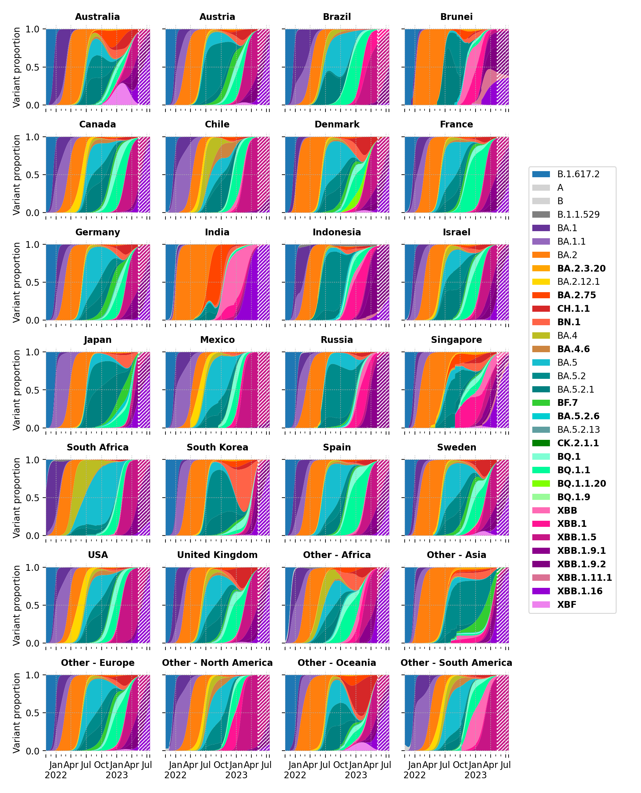
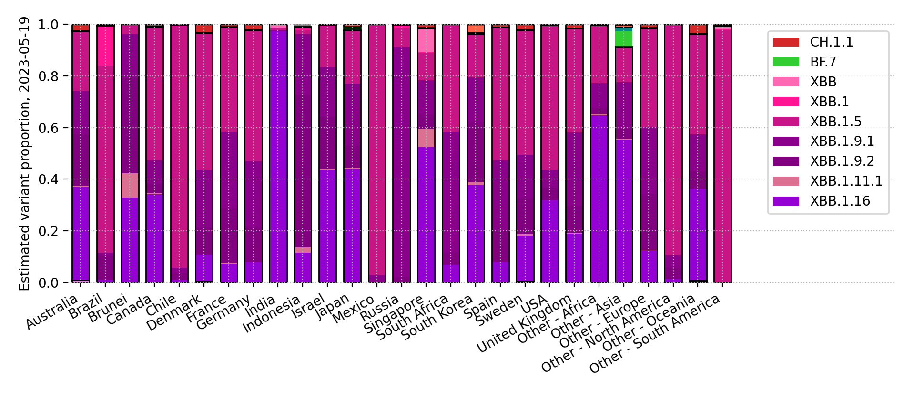

# International SARS-CoV-2 genomic surveillance

This repository uses the [genomicsurveillance](https://github.com/gerstung-lab/genomicsurveillance) model to estimate daily growth rates of a variety of SARS-CoV-2 lineages in selected countries. It fits a logistic linear model to daily lineage counts using a Dirichlet-Multinomial model. The growth rates are modelled in a hierarchical Bayesian fashion using stochastic variational inference. 

The model is described in detail in our publication [Genomic reconstruction of the SARS-CoV-2 epidemic in England](https://www.nature.com/articles/s41586-021-04069-y).

The current code pulls aggregated data from [cov-spectrum.org](cov-spectrum.org); the underlying data is proved by GISAID. Case data is from [Our World in Data](https://ourworldindata.org/explorers/coronavirus-data-explorer).

Latest update: 2022-11-11, based on 7808928 genomic sequences.

## Growth rates

Each dot represents a country (MAP estimate). Bars denote the shared mean, errorbars are the 90% posterior interval.

### In tabular form, per country

Other countries are grouped into geographic regions.

<small><table border="1" class="dataframe">
  <thead>
    <tr style="text-align: right;">
      <th></th>
      <th>Australia</th>
      <th>Belgium</th>
      <th>Canada</th>
      <th>Chile</th>
      <th>Costa Rica</th>
      <th>Denmark</th>
      <th>France</th>
      <th>Germany</th>
      <th>India</th>
      <th>Israel</th>
      <th>Japan</th>
      <th>Mexico</th>
      <th>New Zealand</th>
      <th>Other - Africa</th>
      <th>Other - Asia</th>
      <th>Other - Europe</th>
      <th>Other - North America</th>
      <th>Other - Oceania</th>
      <th>Other - South America</th>
      <th>Peru</th>
      <th>Russia</th>
      <th>Singapore</th>
      <th>South Africa</th>
      <th>South Korea</th>
      <th>Spain</th>
      <th>Turkey</th>
      <th>USA</th>
      <th>United Kingdom</th>
    </tr>
  </thead>
  <tbody>
    <tr>
      <th>B.1.1.529</th>
      <td>-11±1</td>
      <td>-14±1</td>
      <td>-5±1</td>
      <td>-3±1</td>
      <td>-7±3</td>
      <td>-8±1</td>
      <td>-7±0</td>
      <td>-6±0</td>
      <td>-4±0</td>
      <td>-5±1</td>
      <td>-3±1</td>
      <td>-4±1</td>
      <td>-9±1</td>
      <td>-7±0</td>
      <td>-4±0</td>
      <td>-14±0</td>
      <td>-19±1</td>
      <td>&lt;NA&gt;</td>
      <td>-11±0</td>
      <td>-5±1</td>
      <td>-13±1</td>
      <td>-4±1</td>
      <td>-9±0</td>
      <td>-2±2</td>
      <td>-3±0</td>
      <td>-15±1</td>
      <td>-3±0</td>
      <td>-13±0</td>
    </tr>
    <tr>
      <th>BA.1</th>
      <td>-19±0</td>
      <td>-20±0</td>
      <td>-21±0</td>
      <td>-18±0</td>
      <td>-23±0</td>
      <td>-23±0</td>
      <td>-17±0</td>
      <td>-20±0</td>
      <td>-12±0</td>
      <td>-22±0</td>
      <td>-21±0</td>
      <td>-18±0</td>
      <td>-23±0</td>
      <td>-15±0</td>
      <td>-11±0</td>
      <td>-18±0</td>
      <td>-20±0</td>
      <td>-7±1</td>
      <td>-18±0</td>
      <td>-22±0</td>
      <td>-17±0</td>
      <td>-14±0</td>
      <td>-15±0</td>
      <td>-20±0</td>
      <td>-19±0</td>
      <td>-22±0</td>
      <td>-20±0</td>
      <td>-23±0</td>
    </tr>
    <tr>
      <th>BA.1.1</th>
      <td>-17±0</td>
      <td>-17±0</td>
      <td>-18±0</td>
      <td>-16±0</td>
      <td>-21±0</td>
      <td>-17±0</td>
      <td>-15±0</td>
      <td>-17±0</td>
      <td>-11±0</td>
      <td>-18±0</td>
      <td>-17±0</td>
      <td>-16±0</td>
      <td>-14±0</td>
      <td>-14±0</td>
      <td>-10±0</td>
      <td>-16±0</td>
      <td>-18±0</td>
      <td>-8±1</td>
      <td>-17±0</td>
      <td>-21±0</td>
      <td>-17±0</td>
      <td>-8±0</td>
      <td>-13±0</td>
      <td>-16±0</td>
      <td>-17±0</td>
      <td>-17±0</td>
      <td>-18±0</td>
      <td>-19±0</td>
    </tr>
    <tr>
      <th>BA.2</th>
      <td>-9±0</td>
      <td>-11±0</td>
      <td>-12±0</td>
      <td>-10±0</td>
      <td>-12±0</td>
      <td>-12±0</td>
      <td>-7±0</td>
      <td>-11±0</td>
      <td>-3±0</td>
      <td>-11±0</td>
      <td>-10±0</td>
      <td>-10±0</td>
      <td>-9±0</td>
      <td>-7±0</td>
      <td>-6±0</td>
      <td>-10±0</td>
      <td>-11±0</td>
      <td>-9±1</td>
      <td>-10±0</td>
      <td>-13±0</td>
      <td>-12±0</td>
      <td>-4±0</td>
      <td>-8±0</td>
      <td>-9±0</td>
      <td>-9±0</td>
      <td>-9±0</td>
      <td>-10±0</td>
      <td>-12±0</td>
    </tr>
    <tr>
      <th>BA.2.3.20</th>
      <td>5±0</td>
      <td>2±3</td>
      <td>4±1</td>
      <td>1±6</td>
      <td>4±4</td>
      <td>3±1</td>
      <td>4±1</td>
      <td>7±1</td>
      <td>5±5</td>
      <td>7±1</td>
      <td>7±1</td>
      <td>&lt;NA&gt;</td>
      <td>4±2</td>
      <td>10±4</td>
      <td>5±0</td>
      <td>8±0</td>
      <td>&lt;NA&gt;</td>
      <td>16±4</td>
      <td>&lt;NA&gt;</td>
      <td>&lt;NA&gt;</td>
      <td>&lt;NA&gt;</td>
      <td>4±1</td>
      <td>&lt;NA&gt;</td>
      <td>6±1</td>
      <td>6±2</td>
      <td>-10±5</td>
      <td>7±0</td>
      <td>5±1</td>
    </tr>
    <tr>
      <th>BA.2.12.1</th>
      <td>-5±0</td>
      <td>-4±0</td>
      <td>-8±0</td>
      <td>-7±0</td>
      <td>-7±0</td>
      <td>-6±0</td>
      <td>-3±0</td>
      <td>-4±0</td>
      <td>-4±0</td>
      <td>-6±0</td>
      <td>-7±0</td>
      <td>-6±0</td>
      <td>-6±0</td>
      <td>-4±0</td>
      <td>-3±0</td>
      <td>-4±0</td>
      <td>-7±0</td>
      <td>-6±2</td>
      <td>-6±0</td>
      <td>-10±0</td>
      <td>-6±1</td>
      <td>-2±0</td>
      <td>-2±1</td>
      <td>-5±0</td>
      <td>-4±0</td>
      <td>-5±0</td>
      <td>-7±0</td>
      <td>-5±0</td>
    </tr>
    <tr>
      <th>BA.2.75</th>
      <td>3±0</td>
      <td>4±0</td>
      <td>2±0</td>
      <td>5±1</td>
      <td>-4±6</td>
      <td>4±0</td>
      <td>4±0</td>
      <td>4±0</td>
      <td>5±0</td>
      <td>4±0</td>
      <td>2±0</td>
      <td>6±2</td>
      <td>3±0</td>
      <td>4±1</td>
      <td>4±0</td>
      <td>4±0</td>
      <td>-2±3</td>
      <td>&lt;NA&gt;</td>
      <td>4±1</td>
      <td>2±1</td>
      <td>4±1</td>
      <td>4±0</td>
      <td>1±1</td>
      <td>3±0</td>
      <td>6±1</td>
      <td>4±1</td>
      <td>4±0</td>
      <td>4±0</td>
    </tr>
    <tr>
      <th>CH.1.1</th>
      <td>10±2</td>
      <td>9±3</td>
      <td>&lt;NA&gt;</td>
      <td>&lt;NA&gt;</td>
      <td>&lt;NA&gt;</td>
      <td>6±2</td>
      <td>&lt;NA&gt;</td>
      <td>11±3</td>
      <td>17±3</td>
      <td>6±3</td>
      <td>9±3</td>
      <td>&lt;NA&gt;</td>
      <td>&lt;NA&gt;</td>
      <td>&lt;NA&gt;</td>
      <td>20±3</td>
      <td>16±2</td>
      <td>&lt;NA&gt;</td>
      <td>&lt;NA&gt;</td>
      <td>&lt;NA&gt;</td>
      <td>&lt;NA&gt;</td>
      <td>&lt;NA&gt;</td>
      <td>21±3</td>
      <td>&lt;NA&gt;</td>
      <td>8±2</td>
      <td>&lt;NA&gt;</td>
      <td>&lt;NA&gt;</td>
      <td>7±2</td>
      <td>11±2</td>
    </tr>
    <tr>
      <th>BA.2.75.4</th>
      <td>5±1</td>
      <td>3±1</td>
      <td>2±1</td>
      <td>&lt;NA&gt;</td>
      <td>&lt;NA&gt;</td>
      <td>5±1</td>
      <td>5±1</td>
      <td>4±1</td>
      <td>6±0</td>
      <td>1±2</td>
      <td>-4±3</td>
      <td>0±4</td>
      <td>&lt;NA&gt;</td>
      <td>&lt;NA&gt;</td>
      <td>5±2</td>
      <td>5±0</td>
      <td>&lt;NA&gt;</td>
      <td>&lt;NA&gt;</td>
      <td>&lt;NA&gt;</td>
      <td>&lt;NA&gt;</td>
      <td>&lt;NA&gt;</td>
      <td>1±1</td>
      <td>-3±4</td>
      <td>3±2</td>
      <td>4±4</td>
      <td>&lt;NA&gt;</td>
      <td>5±1</td>
      <td>4±1</td>
    </tr>
    <tr>
      <th>BR.2</th>
      <td>10±1</td>
      <td>&lt;NA&gt;</td>
      <td>&lt;NA&gt;</td>
      <td>&lt;NA&gt;</td>
      <td>&lt;NA&gt;</td>
      <td>&lt;NA&gt;</td>
      <td>&lt;NA&gt;</td>
      <td>&lt;NA&gt;</td>
      <td>&lt;NA&gt;</td>
      <td>&lt;NA&gt;</td>
      <td>7±3</td>
      <td>&lt;NA&gt;</td>
      <td>&lt;NA&gt;</td>
      <td>&lt;NA&gt;</td>
      <td>&lt;NA&gt;</td>
      <td>&lt;NA&gt;</td>
      <td>&lt;NA&gt;</td>
      <td>&lt;NA&gt;</td>
      <td>&lt;NA&gt;</td>
      <td>&lt;NA&gt;</td>
      <td>&lt;NA&gt;</td>
      <td>&lt;NA&gt;</td>
      <td>&lt;NA&gt;</td>
      <td>&lt;NA&gt;</td>
      <td>&lt;NA&gt;</td>
      <td>&lt;NA&gt;</td>
      <td>4±3</td>
      <td>&lt;NA&gt;</td>
    </tr>
    <tr>
      <th>BN.1</th>
      <td>7±0</td>
      <td>8±1</td>
      <td>5±1</td>
      <td>7±2</td>
      <td>-5±6</td>
      <td>8±1</td>
      <td>8±2</td>
      <td>7±1</td>
      <td>11±0</td>
      <td>9±1</td>
      <td>10±1</td>
      <td>-1±6</td>
      <td>4±2</td>
      <td>&lt;NA&gt;</td>
      <td>10±1</td>
      <td>11±0</td>
      <td>0±5</td>
      <td>&lt;NA&gt;</td>
      <td>&lt;NA&gt;</td>
      <td>-8±7</td>
      <td>2±5</td>
      <td>7±1</td>
      <td>&lt;NA&gt;</td>
      <td>9±1</td>
      <td>8±4</td>
      <td>6±3</td>
      <td>11±1</td>
      <td>8±0</td>
    </tr>
    <tr>
      <th>BA.4</th>
      <td>-3±0</td>
      <td>-3±0</td>
      <td>-3±0</td>
      <td>-2±0</td>
      <td>-3±0</td>
      <td>-2±0</td>
      <td>-1±0</td>
      <td>-2±0</td>
      <td>-3±0</td>
      <td>-2±0</td>
      <td>-3±0</td>
      <td>-2±0</td>
      <td>-3±0</td>
      <td>-3±0</td>
      <td>-2±0</td>
      <td>-2±0</td>
      <td>-2±0</td>
      <td>4±4</td>
      <td>-2±0</td>
      <td>-3±0</td>
      <td>-5±1</td>
      <td>-2±0</td>
      <td>-2±0</td>
      <td>-3±0</td>
      <td>-1±0</td>
      <td>-2±0</td>
      <td>-2±0</td>
      <td>-2±0</td>
    </tr>
    <tr>
      <th>BA.4.6</th>
      <td>2±0</td>
      <td>3±0</td>
      <td>1±0</td>
      <td>2±0</td>
      <td>2±0</td>
      <td>2±0</td>
      <td>3±0</td>
      <td>2±0</td>
      <td>4±1</td>
      <td>3±0</td>
      <td>1±0</td>
      <td>3±0</td>
      <td>2±0</td>
      <td>1±0</td>
      <td>4±0</td>
      <td>2±0</td>
      <td>2±0</td>
      <td>&lt;NA&gt;</td>
      <td>2±0</td>
      <td>2±0</td>
      <td>1±1</td>
      <td>3±1</td>
      <td>0±0</td>
      <td>1±0</td>
      <td>3±0</td>
      <td>2±1</td>
      <td>2±0</td>
      <td>2±0</td>
    </tr>
    <tr>
      <th>BA.5</th>
      <td>0±0</td>
      <td>0±0</td>
      <td>0±0</td>
      <td>0±0</td>
      <td>0±0</td>
      <td>0±0</td>
      <td>0±0</td>
      <td>0±0</td>
      <td>0±0</td>
      <td>0±0</td>
      <td>0±0</td>
      <td>0±0</td>
      <td>0±0</td>
      <td>0±0</td>
      <td>0±0</td>
      <td>0±0</td>
      <td>0±0</td>
      <td>0±0</td>
      <td>0±0</td>
      <td>0±0</td>
      <td>0±0</td>
      <td>0±0</td>
      <td>0±0</td>
      <td>0±0</td>
      <td>0±0</td>
      <td>0±0</td>
      <td>0±0</td>
      <td>0±0</td>
    </tr>
    <tr>
      <th>BA.5.2</th>
      <td>0±0</td>
      <td>1±0</td>
      <td>1±0</td>
      <td>1±0</td>
      <td>2±0</td>
      <td>1±0</td>
      <td>1±0</td>
      <td>2±0</td>
      <td>1±0</td>
      <td>0±0</td>
      <td>1±0</td>
      <td>1±0</td>
      <td>0±0</td>
      <td>0±0</td>
      <td>0±0</td>
      <td>1±0</td>
      <td>0±0</td>
      <td>2±1</td>
      <td>0±0</td>
      <td>1±0</td>
      <td>2±0</td>
      <td>1±0</td>
      <td>-1±0</td>
      <td>2±0</td>
      <td>1±0</td>
      <td>1±0</td>
      <td>1±0</td>
      <td>1±0</td>
    </tr>
    <tr>
      <th>BF.7</th>
      <td>6±0</td>
      <td>2±0</td>
      <td>5±0</td>
      <td>4±1</td>
      <td>5±3</td>
      <td>5±0</td>
      <td>5±0</td>
      <td>5±0</td>
      <td>3±3</td>
      <td>5±0</td>
      <td>5±0</td>
      <td>6±1</td>
      <td>4±1</td>
      <td>4±1</td>
      <td>6±1</td>
      <td>4±0</td>
      <td>6±1</td>
      <td>&lt;NA&gt;</td>
      <td>5±0</td>
      <td>5±2</td>
      <td>5±0</td>
      <td>0±6</td>
      <td>3±1</td>
      <td>8±1</td>
      <td>5±0</td>
      <td>3±1</td>
      <td>5±0</td>
      <td>4±0</td>
    </tr>
    <tr>
      <th>BA.5.2.6</th>
      <td>5±0</td>
      <td>6±1</td>
      <td>4±1</td>
      <td>1±4</td>
      <td>5±2</td>
      <td>6±0</td>
      <td>6±0</td>
      <td>6±0</td>
      <td>4±1</td>
      <td>5±1</td>
      <td>5±0</td>
      <td>-1±8</td>
      <td>5±2</td>
      <td>3±1</td>
      <td>6±0</td>
      <td>5±0</td>
      <td>2±7</td>
      <td>&lt;NA&gt;</td>
      <td>4±2</td>
      <td>&lt;NA&gt;</td>
      <td>7±1</td>
      <td>7±1</td>
      <td>2±0</td>
      <td>6±1</td>
      <td>5±1</td>
      <td>6±0</td>
      <td>3±0</td>
      <td>5±0</td>
    </tr>
    <tr>
      <th>BA.5.2.13</th>
      <td>5±1</td>
      <td>-1±2</td>
      <td>6±1</td>
      <td>-2±6</td>
      <td>&lt;NA&gt;</td>
      <td>6±1</td>
      <td>5±1</td>
      <td>6±1</td>
      <td>-3±4</td>
      <td>3±2</td>
      <td>-8±4</td>
      <td>-4±5</td>
      <td>&lt;NA&gt;</td>
      <td>&lt;NA&gt;</td>
      <td>5±1</td>
      <td>4±1</td>
      <td>&lt;NA&gt;</td>
      <td>&lt;NA&gt;</td>
      <td>&lt;NA&gt;</td>
      <td>&lt;NA&gt;</td>
      <td>5±6</td>
      <td>6±4</td>
      <td>-6±5</td>
      <td>2±6</td>
      <td>7±2</td>
      <td>0±3</td>
      <td>5±1</td>
      <td>5±0</td>
    </tr>
    <tr>
      <th>CK.2.1.1</th>
      <td>6±3</td>
      <td>5±2</td>
      <td>1±3</td>
      <td>&lt;NA&gt;</td>
      <td>&lt;NA&gt;</td>
      <td>9±2</td>
      <td>10±3</td>
      <td>8±1</td>
      <td>&lt;NA&gt;</td>
      <td>3±3</td>
      <td>8±3</td>
      <td>8±2</td>
      <td>&lt;NA&gt;</td>
      <td>&lt;NA&gt;</td>
      <td>&lt;NA&gt;</td>
      <td>11±1</td>
      <td>&lt;NA&gt;</td>
      <td>&lt;NA&gt;</td>
      <td>&lt;NA&gt;</td>
      <td>&lt;NA&gt;</td>
      <td>&lt;NA&gt;</td>
      <td>20±3</td>
      <td>6±3</td>
      <td>9±3</td>
      <td>12±2</td>
      <td>&lt;NA&gt;</td>
      <td>7±2</td>
      <td>6±2</td>
    </tr>
    <tr>
      <th>BQ.1</th>
      <td>10±1</td>
      <td>9±0</td>
      <td>7±0</td>
      <td>8±1</td>
      <td>7±5</td>
      <td>9±0</td>
      <td>8±0</td>
      <td>8±0</td>
      <td>6±7</td>
      <td>7±0</td>
      <td>8±1</td>
      <td>11±2</td>
      <td>6±2</td>
      <td>8±0</td>
      <td>13±1</td>
      <td>9±0</td>
      <td>12±1</td>
      <td>&lt;NA&gt;</td>
      <td>7±2</td>
      <td>&lt;NA&gt;</td>
      <td>&lt;NA&gt;</td>
      <td>23±2</td>
      <td>6±2</td>
      <td>8±1</td>
      <td>10±1</td>
      <td>8±1</td>
      <td>8±0</td>
      <td>9±0</td>
    </tr>
    <tr>
      <th>BQ.1.1</th>
      <td>9±1</td>
      <td>9±1</td>
      <td>8±0</td>
      <td>12±2</td>
      <td>-12±9</td>
      <td>10±0</td>
      <td>8±0</td>
      <td>10±0</td>
      <td>&lt;NA&gt;</td>
      <td>10±0</td>
      <td>11±1</td>
      <td>9±2</td>
      <td>-1±8</td>
      <td>8±1</td>
      <td>13±1</td>
      <td>11±0</td>
      <td>14±2</td>
      <td>&lt;NA&gt;</td>
      <td>6±2</td>
      <td>&lt;NA&gt;</td>
      <td>&lt;NA&gt;</td>
      <td>17±2</td>
      <td>5±2</td>
      <td>11±1</td>
      <td>12±0</td>
      <td>8±2</td>
      <td>10±0</td>
      <td>8±0</td>
    </tr>
    <tr>
      <th>BQ.1.1.2</th>
      <td>&lt;NA&gt;</td>
      <td>&lt;NA&gt;</td>
      <td>&lt;NA&gt;</td>
      <td>&lt;NA&gt;</td>
      <td>&lt;NA&gt;</td>
      <td>8±3</td>
      <td>18±3</td>
      <td>&lt;NA&gt;</td>
      <td>&lt;NA&gt;</td>
      <td>8±4</td>
      <td>&lt;NA&gt;</td>
      <td>&lt;NA&gt;</td>
      <td>&lt;NA&gt;</td>
      <td>&lt;NA&gt;</td>
      <td>&lt;NA&gt;</td>
      <td>12±3</td>
      <td>&lt;NA&gt;</td>
      <td>&lt;NA&gt;</td>
      <td>&lt;NA&gt;</td>
      <td>&lt;NA&gt;</td>
      <td>&lt;NA&gt;</td>
      <td>&lt;NA&gt;</td>
      <td>&lt;NA&gt;</td>
      <td>&lt;NA&gt;</td>
      <td>&lt;NA&gt;</td>
      <td>&lt;NA&gt;</td>
      <td>10±3</td>
      <td>11±2</td>
    </tr>
    <tr>
      <th>BQ.1.1.8</th>
      <td>5±3</td>
      <td>8±3</td>
      <td>1±2</td>
      <td>&lt;NA&gt;</td>
      <td>&lt;NA&gt;</td>
      <td>4±3</td>
      <td>14±3</td>
      <td>8±3</td>
      <td>&lt;NA&gt;</td>
      <td>&lt;NA&gt;</td>
      <td>&lt;NA&gt;</td>
      <td>&lt;NA&gt;</td>
      <td>&lt;NA&gt;</td>
      <td>&lt;NA&gt;</td>
      <td>18±3</td>
      <td>8±3</td>
      <td>&lt;NA&gt;</td>
      <td>&lt;NA&gt;</td>
      <td>&lt;NA&gt;</td>
      <td>&lt;NA&gt;</td>
      <td>&lt;NA&gt;</td>
      <td>&lt;NA&gt;</td>
      <td>&lt;NA&gt;</td>
      <td>&lt;NA&gt;</td>
      <td>&lt;NA&gt;</td>
      <td>2±4</td>
      <td>4±2</td>
      <td>12±1</td>
    </tr>
    <tr>
      <th>BQ.1.1.10</th>
      <td>&lt;NA&gt;</td>
      <td>&lt;NA&gt;</td>
      <td>&lt;NA&gt;</td>
      <td>&lt;NA&gt;</td>
      <td>&lt;NA&gt;</td>
      <td>8±2</td>
      <td>&lt;NA&gt;</td>
      <td>9±3</td>
      <td>&lt;NA&gt;</td>
      <td>6±4</td>
      <td>&lt;NA&gt;</td>
      <td>&lt;NA&gt;</td>
      <td>&lt;NA&gt;</td>
      <td>&lt;NA&gt;</td>
      <td>&lt;NA&gt;</td>
      <td>10±3</td>
      <td>&lt;NA&gt;</td>
      <td>&lt;NA&gt;</td>
      <td>&lt;NA&gt;</td>
      <td>&lt;NA&gt;</td>
      <td>&lt;NA&gt;</td>
      <td>&lt;NA&gt;</td>
      <td>&lt;NA&gt;</td>
      <td>&lt;NA&gt;</td>
      <td>&lt;NA&gt;</td>
      <td>&lt;NA&gt;</td>
      <td>5±3</td>
      <td>2±3</td>
    </tr>
    <tr>
      <th>XBB</th>
      <td>7±1</td>
      <td>7±2</td>
      <td>6±1</td>
      <td>3±8</td>
      <td>&lt;NA&gt;</td>
      <td>8±1</td>
      <td>11±2</td>
      <td>6±2</td>
      <td>11±0</td>
      <td>11±2</td>
      <td>7±2</td>
      <td>&lt;NA&gt;</td>
      <td>6±3</td>
      <td>3±8</td>
      <td>8±0</td>
      <td>10±1</td>
      <td>&lt;NA&gt;</td>
      <td>&lt;NA&gt;</td>
      <td>-8±8</td>
      <td>&lt;NA&gt;</td>
      <td>&lt;NA&gt;</td>
      <td>8±0</td>
      <td>-9±9</td>
      <td>11±3</td>
      <td>9±5</td>
      <td>-15±9</td>
      <td>8±1</td>
      <td>7±1</td>
    </tr>
    <tr>
      <th>XBB.1</th>
      <td>9±1</td>
      <td>6±2</td>
      <td>2±3</td>
      <td>7±4</td>
      <td>&lt;NA&gt;</td>
      <td>11±1</td>
      <td>8±3</td>
      <td>7±2</td>
      <td>15±1</td>
      <td>11±1</td>
      <td>8±2</td>
      <td>&lt;NA&gt;</td>
      <td>6±4</td>
      <td>&lt;NA&gt;</td>
      <td>7±1</td>
      <td>14±1</td>
      <td>6±4</td>
      <td>22±4</td>
      <td>2±5</td>
      <td>&lt;NA&gt;</td>
      <td>&lt;NA&gt;</td>
      <td>9±0</td>
      <td>&lt;NA&gt;</td>
      <td>10±2</td>
      <td>7±5</td>
      <td>-4±6</td>
      <td>10±1</td>
      <td>10±1</td>
    </tr>
    <tr>
      <th>XBE</th>
      <td>-6±4</td>
      <td>&lt;NA&gt;</td>
      <td>-2±3</td>
      <td>&lt;NA&gt;</td>
      <td>&lt;NA&gt;</td>
      <td>-1±2</td>
      <td>0±2</td>
      <td>1±1</td>
      <td>-1±1</td>
      <td>1±3</td>
      <td>&lt;NA&gt;</td>
      <td>&lt;NA&gt;</td>
      <td>&lt;NA&gt;</td>
      <td>&lt;NA&gt;</td>
      <td>-2±2</td>
      <td>6±0</td>
      <td>-8±7</td>
      <td>&lt;NA&gt;</td>
      <td>&lt;NA&gt;</td>
      <td>&lt;NA&gt;</td>
      <td>&lt;NA&gt;</td>
      <td>&lt;NA&gt;</td>
      <td>&lt;NA&gt;</td>
      <td>2±0</td>
      <td>&lt;NA&gt;</td>
      <td>&lt;NA&gt;</td>
      <td>4±1</td>
      <td>3±1</td>
    </tr>
  </tbody>
</table></small>

Shown is the daily growth advantage over BA.5 in percent. Errors are standard errors.

## Variant share by country

The variant share is extrapolated from the last day with observed data. In countries where a variant hasn't been detected yet, it is assumed to be introduced at levels of 1% of the international average. 

Latest estimated variant proportion.

### In tabular form, per country

<small><table border="1" class="dataframe">
  <thead>
    <tr style="text-align: right;">
      <th></th>
      <th>Australia</th>
      <th>Belgium</th>
      <th>Canada</th>
      <th>Chile</th>
      <th>Costa Rica</th>
      <th>Denmark</th>
      <th>France</th>
      <th>Germany</th>
      <th>India</th>
      <th>Israel</th>
      <th>Japan</th>
      <th>Mexico</th>
      <th>New Zealand</th>
      <th>Peru</th>
      <th>Russia</th>
      <th>Singapore</th>
      <th>South Africa</th>
      <th>South Korea</th>
      <th>Spain</th>
      <th>Turkey</th>
      <th>USA</th>
      <th>United Kingdom</th>
      <th>Other - Africa</th>
      <th>Other - Asia</th>
      <th>Other - Europe</th>
      <th>Other - North America</th>
      <th>Other - Oceania</th>
      <th>Other - South America</th>
    </tr>
  </thead>
  <tbody>
    <tr>
      <th>B.1.1.529</th>
      <td>0.0</td>
      <td>0.0</td>
      <td>0.0</td>
      <td>0.0</td>
      <td>0.0</td>
      <td>0.0</td>
      <td>0.0</td>
      <td>0.0</td>
      <td>0.0</td>
      <td>0.0</td>
      <td>0.0</td>
      <td>0.0</td>
      <td>0.0</td>
      <td>0.0</td>
      <td>0.0</td>
      <td>0.0</td>
      <td>0.0</td>
      <td>0.0</td>
      <td>0.0</td>
      <td>0.0</td>
      <td>0.0</td>
      <td>0.0</td>
      <td>0.0</td>
      <td>0.0</td>
      <td>0.0</td>
      <td>0.0</td>
      <td>(0.0)</td>
      <td>0.0</td>
    </tr>
    <tr>
      <th>BA.1</th>
      <td>0.0</td>
      <td>0.0</td>
      <td>0.0</td>
      <td>0.0</td>
      <td>0.0</td>
      <td>0.0</td>
      <td>0.0</td>
      <td>0.0</td>
      <td>0.0</td>
      <td>0.0</td>
      <td>0.0</td>
      <td>0.0</td>
      <td>0.0</td>
      <td>0.0</td>
      <td>0.0</td>
      <td>0.0</td>
      <td>0.0</td>
      <td>0.0</td>
      <td>0.0</td>
      <td>0.0</td>
      <td>0.0</td>
      <td>0.0</td>
      <td>0.0</td>
      <td>0.0</td>
      <td>0.0</td>
      <td>0.0</td>
      <td>0.0</td>
      <td>0.0</td>
    </tr>
    <tr>
      <th>BA.1.1</th>
      <td>0.0</td>
      <td>0.0</td>
      <td>0.0</td>
      <td>0.0</td>
      <td>0.0</td>
      <td>0.0</td>
      <td>0.0</td>
      <td>0.0</td>
      <td>0.0</td>
      <td>0.0</td>
      <td>0.0</td>
      <td>0.0</td>
      <td>0.0</td>
      <td>0.0</td>
      <td>0.0</td>
      <td>0.0</td>
      <td>0.0</td>
      <td>0.0</td>
      <td>0.0</td>
      <td>0.0</td>
      <td>0.0</td>
      <td>0.0</td>
      <td>0.0</td>
      <td>0.0</td>
      <td>0.0</td>
      <td>0.0</td>
      <td>0.0</td>
      <td>0.0</td>
    </tr>
    <tr>
      <th>BA.2</th>
      <td>0.0</td>
      <td>0.0</td>
      <td>0.0</td>
      <td>0.0</td>
      <td>0.0</td>
      <td>0.0</td>
      <td>0.0</td>
      <td>0.0</td>
      <td>0.0</td>
      <td>0.0</td>
      <td>0.0</td>
      <td>0.0</td>
      <td>0.0</td>
      <td>0.0</td>
      <td>0.0</td>
      <td>0.0</td>
      <td>0.0</td>
      <td>0.0</td>
      <td>0.0</td>
      <td>0.0</td>
      <td>0.0</td>
      <td>0.0</td>
      <td>0.0</td>
      <td>0.0</td>
      <td>0.0</td>
      <td>0.0</td>
      <td>0.0</td>
      <td>0.0</td>
    </tr>
    <tr>
      <th>BA.2.3.20</th>
      <td>2.3</td>
      <td>0.2</td>
      <td>0.8</td>
      <td>0.5</td>
      <td>3.1</td>
      <td>0.3</td>
      <td>0.2</td>
      <td>0.6</td>
      <td>0.0</td>
      <td>1.7</td>
      <td>2.1</td>
      <td>(0.0)</td>
      <td>2.8</td>
      <td>(0.0)</td>
      <td>(0.0)</td>
      <td>0.7</td>
      <td>(0.0)</td>
      <td>3.6</td>
      <td>0.2</td>
      <td>0.0</td>
      <td>0.9</td>
      <td>0.2</td>
      <td>1.1</td>
      <td>2.1</td>
      <td>1.6</td>
      <td>(0.0)</td>
      <td>8.3</td>
      <td>(0.0)</td>
    </tr>
    <tr>
      <th>BA.2.12.1</th>
      <td>0.0</td>
      <td>0.0</td>
      <td>0.0</td>
      <td>0.0</td>
      <td>0.0</td>
      <td>0.0</td>
      <td>0.0</td>
      <td>0.0</td>
      <td>0.0</td>
      <td>0.0</td>
      <td>0.0</td>
      <td>0.0</td>
      <td>0.0</td>
      <td>0.0</td>
      <td>0.0</td>
      <td>0.0</td>
      <td>0.0</td>
      <td>0.0</td>
      <td>0.0</td>
      <td>0.0</td>
      <td>0.0</td>
      <td>0.0</td>
      <td>0.0</td>
      <td>0.0</td>
      <td>0.0</td>
      <td>0.0</td>
      <td>0.0</td>
      <td>0.0</td>
    </tr>
    <tr>
      <th>BA.2.75</th>
      <td>6.2</td>
      <td>1.5</td>
      <td>1.8</td>
      <td>2.8</td>
      <td>0.2</td>
      <td>1.5</td>
      <td>0.9</td>
      <td>1.6</td>
      <td>12.8</td>
      <td>2.6</td>
      <td>1.0</td>
      <td>2.9</td>
      <td>11.7</td>
      <td>0.9</td>
      <td>1.9</td>
      <td>5.6</td>
      <td>1.1</td>
      <td>2.4</td>
      <td>1.7</td>
      <td>3.3</td>
      <td>1.9</td>
      <td>3.0</td>
      <td>0.2</td>
      <td>4.7</td>
      <td>2.1</td>
      <td>0.1</td>
      <td>(0.0)</td>
      <td>1.6</td>
    </tr>
    <tr>
      <th>CH.1.1</th>
      <td>1.8</td>
      <td>0.3</td>
      <td>(0.0)</td>
      <td>(0.0)</td>
      <td>(0.0)</td>
      <td>0.3</td>
      <td>(0.0)</td>
      <td>0.2</td>
      <td>2.0</td>
      <td>0.3</td>
      <td>0.8</td>
      <td>(0.0)</td>
      <td>(0.0)</td>
      <td>(0.0)</td>
      <td>(0.0)</td>
      <td>0.3</td>
      <td>(0.0)</td>
      <td>1.5</td>
      <td>(0.0)</td>
      <td>(0.0)</td>
      <td>0.3</td>
      <td>0.8</td>
      <td>(0.0)</td>
      <td>1.1</td>
      <td>2.8</td>
      <td>(0.0)</td>
      <td>(0.0)</td>
      <td>(0.0)</td>
    </tr>
    <tr>
      <th>BA.2.75.4</th>
      <td>0.3</td>
      <td>0.2</td>
      <td>0.1</td>
      <td>(0.0)</td>
      <td>(0.0)</td>
      <td>0.1</td>
      <td>0.1</td>
      <td>0.1</td>
      <td>0.9</td>
      <td>0.1</td>
      <td>0.0</td>
      <td>0.1</td>
      <td>(0.0)</td>
      <td>(0.0)</td>
      <td>(0.0)</td>
      <td>0.0</td>
      <td>0.1</td>
      <td>0.1</td>
      <td>0.1</td>
      <td>(0.0)</td>
      <td>0.2</td>
      <td>0.1</td>
      <td>(0.0)</td>
      <td>0.1</td>
      <td>0.4</td>
      <td>(0.0)</td>
      <td>(0.0)</td>
      <td>(0.0)</td>
    </tr>
    <tr>
      <th>BR.2</th>
      <td>11.5</td>
      <td>(0.0)</td>
      <td>(0.0)</td>
      <td>(0.0)</td>
      <td>(0.0)</td>
      <td>(0.0)</td>
      <td>(0.0)</td>
      <td>(0.0)</td>
      <td>(0.0)</td>
      <td>(0.0)</td>
      <td>0.2</td>
      <td>(0.0)</td>
      <td>(0.0)</td>
      <td>(0.0)</td>
      <td>(0.0)</td>
      <td>(0.0)</td>
      <td>(0.0)</td>
      <td>(0.0)</td>
      <td>(0.0)</td>
      <td>(0.0)</td>
      <td>0.0</td>
      <td>(0.0)</td>
      <td>(0.0)</td>
      <td>(0.0)</td>
      <td>(0.0)</td>
      <td>(0.0)</td>
      <td>(0.0)</td>
      <td>(0.0)</td>
    </tr>
    <tr>
      <th>BN.1</th>
      <td>6.3</td>
      <td>2.1</td>
      <td>0.4</td>
      <td>3.0</td>
      <td>0.1</td>
      <td>3.2</td>
      <td>0.6</td>
      <td>2.1</td>
      <td>16.2</td>
      <td>6.0</td>
      <td>5.1</td>
      <td>1.4</td>
      <td>2.1</td>
      <td>0.1</td>
      <td>0.4</td>
      <td>3.4</td>
      <td>(0.1)</td>
      <td>11.1</td>
      <td>0.7</td>
      <td>1.9</td>
      <td>3.0</td>
      <td>4.5</td>
      <td>(0.0)</td>
      <td>8.7</td>
      <td>5.4</td>
      <td>1.0</td>
      <td>(0.1)</td>
      <td>(0.1)</td>
    </tr>
    <tr>
      <th>BA.4</th>
      <td>0.1</td>
      <td>0.0</td>
      <td>0.1</td>
      <td>1.7</td>
      <td>1.4</td>
      <td>0.1</td>
      <td>0.1</td>
      <td>0.1</td>
      <td>0.0</td>
      <td>0.1</td>
      <td>0.0</td>
      <td>0.5</td>
      <td>0.2</td>
      <td>0.5</td>
      <td>0.0</td>
      <td>0.0</td>
      <td>3.6</td>
      <td>0.0</td>
      <td>0.1</td>
      <td>0.0</td>
      <td>0.1</td>
      <td>0.1</td>
      <td>0.0</td>
      <td>0.0</td>
      <td>0.1</td>
      <td>0.1</td>
      <td>0.3</td>
      <td>0.7</td>
    </tr>
    <tr>
      <th>BA.4.6</th>
      <td>2.9</td>
      <td>2.2</td>
      <td>5.8</td>
      <td>19.7</td>
      <td>8.0</td>
      <td>1.4</td>
      <td>1.6</td>
      <td>1.3</td>
      <td>0.0</td>
      <td>1.1</td>
      <td>0.2</td>
      <td>3.4</td>
      <td>8.4</td>
      <td>43.3</td>
      <td>0.1</td>
      <td>0.0</td>
      <td>2.6</td>
      <td>0.1</td>
      <td>2.2</td>
      <td>0.1</td>
      <td>5.9</td>
      <td>1.9</td>
      <td>0.0</td>
      <td>0.7</td>
      <td>1.5</td>
      <td>16.0</td>
      <td>(0.0)</td>
      <td>26.4</td>
    </tr>
    <tr>
      <th>BA.5</th>
      <td>4.2</td>
      <td>4.5</td>
      <td>9.0</td>
      <td>5.5</td>
      <td>31.2</td>
      <td>5.7</td>
      <td>3.1</td>
      <td>9.5</td>
      <td>0.0</td>
      <td>3.4</td>
      <td>3.4</td>
      <td>18.7</td>
      <td>13.9</td>
      <td>28.8</td>
      <td>2.9</td>
      <td>0.2</td>
      <td>45.4</td>
      <td>1.6</td>
      <td>4.6</td>
      <td>4.5</td>
      <td>6.9</td>
      <td>4.1</td>
      <td>0.3</td>
      <td>1.0</td>
      <td>5.5</td>
      <td>2.6</td>
      <td>5.1</td>
      <td>20.0</td>
    </tr>
    <tr>
      <th>BA.5.2</th>
      <td>16.7</td>
      <td>8.0</td>
      <td>30.3</td>
      <td>27.3</td>
      <td>45.3</td>
      <td>15.6</td>
      <td>5.6</td>
      <td>23.3</td>
      <td>0.1</td>
      <td>12.7</td>
      <td>68.4</td>
      <td>23.6</td>
      <td>36.4</td>
      <td>22.0</td>
      <td>73.5</td>
      <td>2.6</td>
      <td>8.2</td>
      <td>44.8</td>
      <td>7.0</td>
      <td>30.3</td>
      <td>17.6</td>
      <td>9.6</td>
      <td>0.3</td>
      <td>12.0</td>
      <td>12.6</td>
      <td>4.7</td>
      <td>75.2</td>
      <td>18.3</td>
    </tr>
    <tr>
      <th>BF.7</th>
      <td>4.3</td>
      <td>19.3</td>
      <td>11.5</td>
      <td>2.5</td>
      <td>2.9</td>
      <td>21.1</td>
      <td>9.5</td>
      <td>25.5</td>
      <td>0.0</td>
      <td>8.7</td>
      <td>3.2</td>
      <td>5.1</td>
      <td>4.6</td>
      <td>3.3</td>
      <td>10.3</td>
      <td>0.0</td>
      <td>2.2</td>
      <td>7.4</td>
      <td>7.4</td>
      <td>1.1</td>
      <td>6.1</td>
      <td>6.6</td>
      <td>0.5</td>
      <td>0.6</td>
      <td>13.7</td>
      <td>2.1</td>
      <td>(0.2)</td>
      <td>18.2</td>
    </tr>
    <tr>
      <th>BA.5.2.6</th>
      <td>2.9</td>
      <td>1.6</td>
      <td>0.4</td>
      <td>0.4</td>
      <td>6.6</td>
      <td>2.2</td>
      <td>1.3</td>
      <td>2.0</td>
      <td>0.0</td>
      <td>1.0</td>
      <td>2.1</td>
      <td>0.3</td>
      <td>4.6</td>
      <td>(0.1)</td>
      <td>9.6</td>
      <td>2.3</td>
      <td>4.0</td>
      <td>1.6</td>
      <td>0.4</td>
      <td>20.1</td>
      <td>0.9</td>
      <td>1.5</td>
      <td>0.3</td>
      <td>18.2</td>
      <td>1.4</td>
      <td>0.2</td>
      <td>(0.1)</td>
      <td>1.4</td>
    </tr>
    <tr>
      <th>BA.5.2.13</th>
      <td>0.3</td>
      <td>0.0</td>
      <td>0.7</td>
      <td>0.1</td>
      <td>(0.0)</td>
      <td>0.7</td>
      <td>0.1</td>
      <td>0.4</td>
      <td>0.0</td>
      <td>0.1</td>
      <td>0.0</td>
      <td>0.1</td>
      <td>(0.0)</td>
      <td>(0.0)</td>
      <td>0.3</td>
      <td>0.0</td>
      <td>0.1</td>
      <td>0.1</td>
      <td>0.3</td>
      <td>0.1</td>
      <td>0.1</td>
      <td>1.5</td>
      <td>(0.0)</td>
      <td>0.2</td>
      <td>0.1</td>
      <td>(0.0)</td>
      <td>(0.0)</td>
      <td>(0.0)</td>
    </tr>
    <tr>
      <th>CK.2.1.1</th>
      <td>0.2</td>
      <td>0.2</td>
      <td>0.1</td>
      <td>(0.0)</td>
      <td>(0.0)</td>
      <td>0.8</td>
      <td>0.2</td>
      <td>2.6</td>
      <td>(0.0)</td>
      <td>0.2</td>
      <td>0.2</td>
      <td>4.2</td>
      <td>(0.0)</td>
      <td>(0.0)</td>
      <td>(0.0)</td>
      <td>0.3</td>
      <td>1.4</td>
      <td>0.3</td>
      <td>5.1</td>
      <td>(0.0)</td>
      <td>0.4</td>
      <td>0.2</td>
      <td>(0.0)</td>
      <td>(0.0)</td>
      <td>1.3</td>
      <td>(0.0)</td>
      <td>(0.0)</td>
      <td>(0.0)</td>
    </tr>
    <tr>
      <th>BQ.1</th>
      <td>20.3</td>
      <td>28.3</td>
      <td>23.5</td>
      <td>15.8</td>
      <td>1.0</td>
      <td>18.0</td>
      <td>12.6</td>
      <td>14.5</td>
      <td>0.2</td>
      <td>17.3</td>
      <td>2.2</td>
      <td>23.3</td>
      <td>10.8</td>
      <td>(0.3)</td>
      <td>(0.3)</td>
      <td>9.0</td>
      <td>21.0</td>
      <td>6.6</td>
      <td>24.7</td>
      <td>22.2</td>
      <td>27.5</td>
      <td>36.0</td>
      <td>55.2</td>
      <td>19.2</td>
      <td>24.6</td>
      <td>42.9</td>
      <td>(0.3)</td>
      <td>7.4</td>
    </tr>
    <tr>
      <th>BQ.1.1</th>
      <td>9.7</td>
      <td>30.0</td>
      <td>14.7</td>
      <td>19.3</td>
      <td>0.0</td>
      <td>25.2</td>
      <td>62.7</td>
      <td>15.3</td>
      <td>(0.2)</td>
      <td>38.0</td>
      <td>9.1</td>
      <td>16.2</td>
      <td>0.1</td>
      <td>(0.4)</td>
      <td>(0.4)</td>
      <td>5.1</td>
      <td>10.2</td>
      <td>14.4</td>
      <td>45.1</td>
      <td>15.4</td>
      <td>25.4</td>
      <td>20.1</td>
      <td>42.1</td>
      <td>13.3</td>
      <td>19.2</td>
      <td>23.3</td>
      <td>(0.4)</td>
      <td>5.3</td>
    </tr>
    <tr>
      <th>BQ.1.1.2</th>
      <td>(0.0)</td>
      <td>(0.0)</td>
      <td>(0.0)</td>
      <td>(0.0)</td>
      <td>(0.0)</td>
      <td>0.6</td>
      <td>0.4</td>
      <td>(0.0)</td>
      <td>(0.0)</td>
      <td>0.5</td>
      <td>(0.0)</td>
      <td>(0.0)</td>
      <td>(0.0)</td>
      <td>(0.0)</td>
      <td>(0.0)</td>
      <td>(0.0)</td>
      <td>(0.0)</td>
      <td>(0.0)</td>
      <td>(0.0)</td>
      <td>(0.0)</td>
      <td>0.3</td>
      <td>2.6</td>
      <td>(0.0)</td>
      <td>(0.0)</td>
      <td>0.5</td>
      <td>(0.0)</td>
      <td>(0.0)</td>
      <td>(0.0)</td>
    </tr>
    <tr>
      <th>BQ.1.1.8</th>
      <td>0.2</td>
      <td>0.2</td>
      <td>0.1</td>
      <td>(0.0)</td>
      <td>(0.0)</td>
      <td>0.1</td>
      <td>0.6</td>
      <td>0.1</td>
      <td>(0.0)</td>
      <td>(0.0)</td>
      <td>(0.0)</td>
      <td>(0.0)</td>
      <td>(0.0)</td>
      <td>(0.0)</td>
      <td>(0.0)</td>
      <td>(0.0)</td>
      <td>(0.0)</td>
      <td>(0.0)</td>
      <td>(0.0)</td>
      <td>0.3</td>
      <td>0.0</td>
      <td>5.7</td>
      <td>(0.0)</td>
      <td>0.5</td>
      <td>0.2</td>
      <td>(0.0)</td>
      <td>(0.0)</td>
      <td>(0.0)</td>
    </tr>
    <tr>
      <th>BQ.1.1.10</th>
      <td>(0.0)</td>
      <td>(0.0)</td>
      <td>(0.0)</td>
      <td>(0.0)</td>
      <td>(0.0)</td>
      <td>0.8</td>
      <td>(0.0)</td>
      <td>0.3</td>
      <td>(0.0)</td>
      <td>0.3</td>
      <td>(0.0)</td>
      <td>(0.0)</td>
      <td>(0.0)</td>
      <td>(0.0)</td>
      <td>(0.0)</td>
      <td>(0.0)</td>
      <td>(0.0)</td>
      <td>(0.0)</td>
      <td>(0.0)</td>
      <td>(0.0)</td>
      <td>0.1</td>
      <td>0.1</td>
      <td>(0.0)</td>
      <td>(0.0)</td>
      <td>0.3</td>
      <td>(0.0)</td>
      <td>(0.0)</td>
      <td>(0.0)</td>
    </tr>
    <tr>
      <th>XBB</th>
      <td>2.3</td>
      <td>0.6</td>
      <td>0.6</td>
      <td>0.4</td>
      <td>(0.0)</td>
      <td>0.4</td>
      <td>0.3</td>
      <td>0.2</td>
      <td>38.8</td>
      <td>1.4</td>
      <td>0.7</td>
      <td>(0.0)</td>
      <td>1.9</td>
      <td>(0.0)</td>
      <td>(0.0)</td>
      <td>8.5</td>
      <td>0.0</td>
      <td>1.3</td>
      <td>0.2</td>
      <td>0.0</td>
      <td>0.6</td>
      <td>0.5</td>
      <td>0.0</td>
      <td>8.6</td>
      <td>1.1</td>
      <td>(0.0)</td>
      <td>(0.0)</td>
      <td>0.0</td>
    </tr>
    <tr>
      <th>XBB.1</th>
      <td>7.4</td>
      <td>0.8</td>
      <td>0.1</td>
      <td>1.0</td>
      <td>(0.1)</td>
      <td>1.9</td>
      <td>0.2</td>
      <td>0.5</td>
      <td>28.6</td>
      <td>4.2</td>
      <td>1.3</td>
      <td>(0.1)</td>
      <td>2.4</td>
      <td>(0.1)</td>
      <td>(0.1)</td>
      <td>61.8</td>
      <td>(0.1)</td>
      <td>2.9</td>
      <td>0.1</td>
      <td>0.7</td>
      <td>1.6</td>
      <td>0.8</td>
      <td>(0.0)</td>
      <td>8.9</td>
      <td>2.1</td>
      <td>6.8</td>
      <td>9.8</td>
      <td>0.7</td>
    </tr>
    <tr>
      <th>XBE</th>
      <td>0.0</td>
      <td>(0.0)</td>
      <td>0.0</td>
      <td>(0.0)</td>
      <td>(0.0)</td>
      <td>0.0</td>
      <td>0.0</td>
      <td>0.0</td>
      <td>0.0</td>
      <td>0.0</td>
      <td>(0.0)</td>
      <td>(0.0)</td>
      <td>(0.0)</td>
      <td>(0.0)</td>
      <td>(0.0)</td>
      <td>(0.0)</td>
      <td>(0.0)</td>
      <td>0.2</td>
      <td>(0.0)</td>
      <td>(0.0)</td>
      <td>0.1</td>
      <td>0.1</td>
      <td>(0.0)</td>
      <td>0.0</td>
      <td>3.5</td>
      <td>0.1</td>
      <td>(0.0)</td>
      <td>(0.0)</td>
    </tr>
  </tbody>
</table></small>

Shown is the estimated variant proportion on 2022-11-11 in percent. 

Values in parentheses mean that the variant has not been detected in the specific country and are imputed instead.
